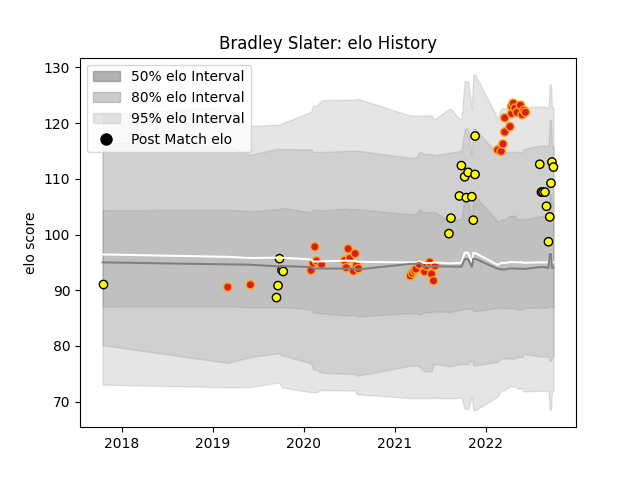

---  
layout: page  
title: Bradley Slater  
date: 2023-02-24 09:52:19.151050  
categories: player  
---
# Bradley Slater

## Positions: H, FL

## Current elo: 112.0

## Current Percentile: 87.0

# Elo History

# Match History

| Team     |   Appearances |   Win Rate |
|:---------|--------------:|-----------:|
| Chiefs   |            41 |   0.512195 |
| Taranaki |            27 |   0.555556 |

| Opponent                 |   Matches |   Win Rate |
|:-------------------------|----------:|-----------:|
| Crusaders                |         8 |   0.375    |
| Blues                    |         7 |   0.285714 |
| Highlanders              |         5 |   0.4      |
| Hurricanes               |         4 |   0.25     |
| Moana Pasifika           |         4 |   1        |
| Otago                    |         3 |   1        |
| New South Wales Waratahs |         3 |   1        |
| Bay of Plenty            |         3 |   0.333333 |
| Southland                |         3 |   1        |
| Waikato                  |         3 |   0.333333 |
| Brumbies                 |         3 |   0.333333 |
| Hawke's Bay              |         2 |   0.5      |
| Sunwolves                |         2 |   0.5      |
| Manawatu                 |         2 |   1        |
| Wellington               |         2 |   0.5      |
| North Harbour            |         2 |   0        |
| Northland                |         2 |   0.5      |
| Queensland Reds          |         2 |   0.5      |
| Auckland                 |         2 |   0        |
| Tasman                   |         1 |   0        |
| Melbourne Rebels         |         1 |   1        |
| Fijian Drua              |         1 |   1        |
| Counties Manukau         |         1 |   1        |
| Canterbury               |         1 |   1        |
| Western Force            |         1 |   1        |