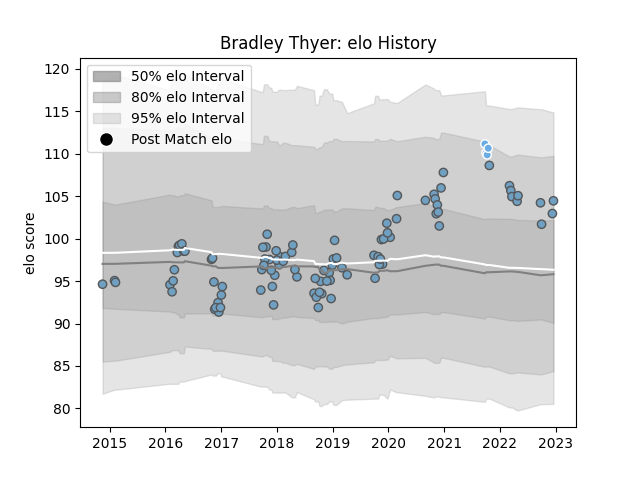

---  
layout: page  
title: Bradley Thyer  
date: 2023-01-23 15:32:01.790863  
categories: player  
---
# Bradley Thyer

## Positions: P

## Current elo: 114.0

## Current Percentile: 85.0

# Elo History

# Match History

| Team             |   Appearances |   Win Rate |
|:-----------------|--------------:|-----------:|
| Cardiff Blues    |            96 |   0.489583 |
| Glasgow Warriors |             4 |   0.75     |

| Opponent          |   Matches |   Win Rate |
|:------------------|----------:|-----------:|
| Dragons           |         9 |   1        |
| Glasgow Warriors  |         8 |   0        |
| Benetton Treviso  |         7 |   0.714286 |
| Scarlets          |         7 |   0.428571 |
| Ospreys           |         7 |   0.285714 |
| Munster           |         6 |   0.166667 |
| Ulster            |         5 |   0.2      |
| Edinburgh         |         5 |   0.4      |
| Zebre             |         4 |   0.75     |
| Cheetahs          |         4 |   0.75     |
| Connacht          |         4 |   0.75     |
| Southern Kings    |         3 |   1        |
| Newcastle Falcons |         3 |   0.666667 |
| Lyon              |         3 |   1        |
| Lions             |         3 |   0.333333 |
| Leinster          |         3 |   0        |
| Leicester Tigers  |         3 |   0        |
| Sale Sharks       |         2 |   0.5      |
| Saracens          |         2 |   0        |
| Stade Toulousain  |         2 |   1        |
| Brive             |         2 |   0.5      |
| Bath Rugby        |         2 |   0.5      |
| Gloucester Rugby  |         1 |   1        |
| Exeter Chiefs     |         1 |   0        |
| Sharks            |         1 |   1        |
| Calvisano         |         1 |   1        |
| Stormers          |         1 |   0        |
| Wasps             |         1 |   1        |