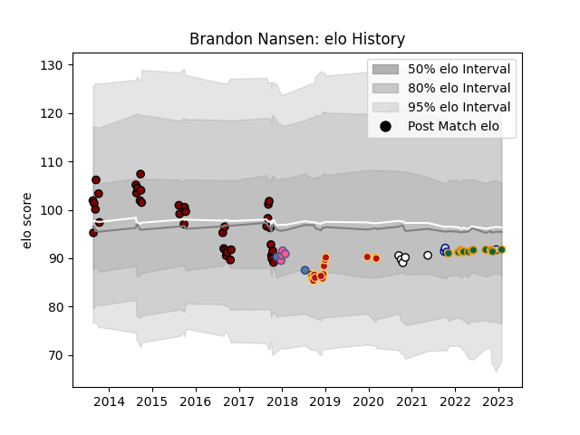

---  
layout: page  
title: Brandon Nansen  
date: 2023-03-17 17:00:04.825908  
categories: player  
---
# Brandon Nansen

## Positions: L, FL

## Country: Samoa

## Current elo: 90.0

## Current Percentile: 34.0

# Elo History

# Match History

| Team                 |   Appearances |   Win Rate |
|:---------------------|--------------:|-----------:|
| North Harbour        |            37 |   0.432432 |
| Dragons              |            15 |   0.4      |
| Northampton Saints   |            15 |   0.533333 |
| Brive                |             5 |   0.2      |
| Bedford              |             4 |   0.5      |
| Stade Francais Paris |             4 |   0.25     |
| Samoa                |             2 |   0.5      |

| Opponent            |   Matches |   Win Rate |
|:--------------------|----------:|-----------:|
| Otago               |         5 |   0.2      |
| Wellington          |         4 |   0.25     |
| Canterbury          |         4 |   0.25     |
| Manawatu            |         3 |   0.333333 |
| Northland           |         3 |   0.666667 |
| Auckland            |         3 |   0.333333 |
| Waikato             |         3 |   0.333333 |
| Counties Manukau    |         3 |   0.666667 |
| Southland           |         3 |   0.666667 |
| Pau                 |         2 |   0.5      |
| Sale Sharks         |         2 |   0        |
| Saracens            |         2 |   0        |
| Hawke's Bay         |         2 |   1        |
| Scarlets            |         2 |   0.5      |
| Tasman              |         2 |   0.5      |
| Cardiff Blues       |         2 |   0        |
| Bordeaux Begles     |         2 |   0.5      |
| Benetton Treviso    |         2 |   0        |
| Bath Rugby          |         2 |   1        |
| Taranaki            |         1 |   1        |
| Stade Toulousain    |         1 |   0        |
| Toulon              |         1 |   0        |
| Southern Kings      |         1 |   1        |
| Ulster              |         1 |   0        |
| Wasps               |         1 |   1        |
| Romania             |         1 |   0        |
| Richmond            |         1 |   0        |
| Worcester Warriors  |         1 |   1        |
| Ospreys             |         1 |   1        |
| Ampthill            |         1 |   1        |
| Northampton Saints  |         1 |   0        |
| Newcastle Falcons   |         1 |   1        |
| Bay of Plenty       |         1 |   0        |
| Bristol Rugby       |         1 |   1        |
| Castres Olympique   |         1 |   0        |
| Cheetahs            |         1 |   1        |
| Clermont Auvergne   |         1 |   0        |
| Doncaster           |         1 |   1        |
| Ealing Trailfinders |         1 |   0        |
| Edinburgh           |         1 |   1        |
| Exeter Chiefs       |         1 |   0        |
| Germany             |         1 |   1        |
| Glasgow Warriors    |         1 |   0        |
| Gloucester Rugby    |         1 |   0        |
| Leicester Tigers    |         1 |   1        |
| Leinster            |         1 |   0        |
| London Irish        |         1 |   1        |
| Lyon                |         1 |   0        |
| Montpellier Herault |         1 |   0        |
| Zebre               |         1 |   1        |