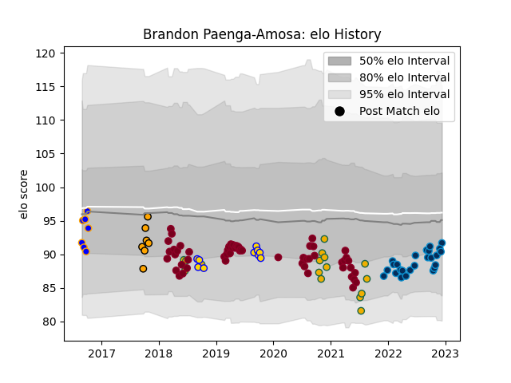

---  
layout: page  
title: Brandon Paenga-Amosa  
date: 2022-11-16 11:34:34.051337  
categories: player  
---
# Brandon Paenga-Amosa

## Positions: H

## Country: Australia

## Current elo: 100.0

## Current Percentile: 60.0

# Elo History

# Match History

| Team                |   Appearances |   Win Rate |
|:--------------------|--------------:|-----------:|
| Queensland Reds     |            55 |   0.463636 |
| Montpellier Herault |            22 |   0.704545 |
| Australia           |            16 |   0.34375  |

| Opponent                 |   Matches |   Win Rate |
|:-------------------------|----------:|-----------:|
| Brumbies                 |        11 |   0.545455 |
| Melbourne Rebels         |         8 |   0.5625   |
| New South Wales Waratahs |         7 |   0.285714 |
| New Zealand              |         6 |   0.166667 |
| Western Force            |         4 |   0.75     |
| Sunwolves                |         4 |   0.75     |
| France                   |         3 |   0.666667 |
| Ireland                  |         3 |   0.333333 |
| Highlanders              |         3 |   0        |
| Argentina                |         3 |   0.5      |
| Bordeaux Begles          |         3 |   0.666667 |
| Blues                    |         3 |   0.333333 |
| Chiefs                   |         3 |   0.333333 |
| Crusaders                |         2 |   0        |
| Stormers                 |         2 |   0.5      |
| Stade Toulousain         |         2 |   0        |
| Stade Francais Paris     |         2 |   1        |
| Racing 92                |         2 |   0.5      |
| Perpignan                |         2 |   1        |
| Pau                      |         2 |   1        |
| Brive                    |         2 |   0.75     |
| Bulls                    |         2 |   0.5      |
| Biarritz Olympique       |         2 |   1        |
| La Rochelle              |         2 |   0.5      |
| Jaguares                 |         2 |   0.5      |
| Hurricanes               |         2 |   0        |
| Lyon                     |         1 |   0        |
| Sharks                   |         1 |   1        |
| South Africa             |         1 |   0        |
| Castres Olympique        |         1 |   1        |
| Toulon                   |         1 |   1        |
| Lions                    |         1 |   1        |