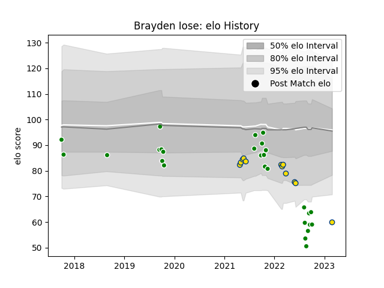

---  
layout: page  
title: Brayden Iose  
date: 2023-03-21 17:57:39.645337  
categories: player  
---
# Brayden Iose

Last updated: 2023-03-21
## Positions: N8

## Current elo: 58.0

## Current Percentile: 1.0

# Elo History

# Match History

| Team       |   Appearances |   Win Rate |
|:-----------|--------------:|-----------:|
| Manawatu   |            27 |   0.296296 |
| Hurricanes |            14 |   0.571429 |

| Opponent                 |   Matches |   Win Rate |
|:-------------------------|----------:|-----------:|
| Southland                |         3 |   1        |
| Canterbury               |         3 |   0.333333 |
| Counties Manukau         |         3 |   0.666667 |
| Taranaki                 |         3 |   0        |
| Hawke's Bay              |         3 |   0        |
| Otago                    |         3 |   0.333333 |
| Brumbies                 |         2 |   0        |
| Highlanders              |         2 |   1        |
| Melbourne Rebels         |         2 |   1        |
| Bay of Plenty            |         2 |   0        |
| New South Wales Waratahs |         2 |   1        |
| North Harbour            |         2 |   0        |
| Northland                |         2 |   0.5      |
| Auckland                 |         1 |   0        |
| Wellington               |         1 |   0        |
| Tasman                   |         1 |   0        |
| Moana Pasifika           |         1 |   0        |
| Queensland Reds          |         1 |   1        |
| Crusaders                |         1 |   0        |
| Chiefs                   |         1 |   0        |
| Blues                    |         1 |   1        |
| Western Force            |         1 |   0        |