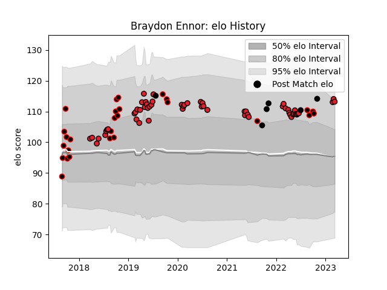

---  
layout: page  
title: Braydon Ennor  
date: 2023-03-17 17:01:53.773231  
categories: player  
---
# Braydon Ennor

## Positions: C, W

## Country: New Zealand

## Current elo: 113.0

## Current Percentile: 88.0

# Elo History

# Match History

| Team        |   Appearances |   Win Rate |
|:------------|--------------:|-----------:|
| Crusaders   |            57 |   0.859649 |
| Canterbury  |            27 |   0.777778 |
| New Zealand |             6 |   1        |

| Opponent                 |   Matches |   Win Rate |
|:-------------------------|----------:|-----------:|
| Highlanders              |         8 |   1        |
| Chiefs                   |         8 |   0.5      |
| Hurricanes               |         8 |   1        |
| Blues                    |         7 |   0.857143 |
| Queensland Reds          |         4 |   1        |
| Hawke's Bay              |         3 |   1        |
| New South Wales Waratahs |         3 |   0.666667 |
| North Harbour            |         3 |   1        |
| Otago                    |         3 |   1        |
| Auckland                 |         3 |   0.333333 |
| Melbourne Rebels         |         3 |   1        |
| Taranaki                 |         3 |   0.333333 |
| Tasman                   |         3 |   0.666667 |
| Sharks                   |         2 |   0.75     |
| Northland                |         2 |   1        |
| Wellington               |         2 |   0.5      |
| Argentina                |         2 |   1        |
| Western Force            |         2 |   1        |
| Lions                    |         2 |   1        |
| Jaguares                 |         2 |   1        |
| Fijian Drua              |         2 |   0.5      |
| Counties Manukau         |         2 |   1        |
| Bulls                    |         2 |   1        |
| Brumbies                 |         2 |   1        |
| Japan                    |         1 |   1        |
| Italy                    |         1 |   1        |
| Ireland                  |         1 |   1        |
| Southland                |         1 |   1        |
| Stormers                 |         1 |   0.5      |
| Sunwolves                |         1 |   1        |
| United States of America |         1 |   1        |
| Waikato                  |         1 |   1        |
| Manawatu                 |         1 |   1        |