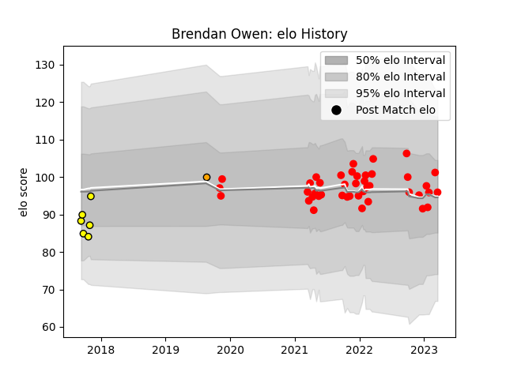

---  
layout: page  
title: Brendan Owen  
date: 2023-01-21 15:40:30.485649  
categories: player  
---
# Brendan Owen

## Positions: FB, W

## Current elo: 102.0

## Current Percentile: 50.0

# Elo History

# Match History

| Team             |   Appearances |   Win Rate |
|:-----------------|--------------:|-----------:|
| Jersey           |            39 |   0.641026 |
| Perth Spirit     |             5 |   0.4      |
| Boland Cavaliers |             1 |   0.5      |

| Opponent            |   Matches |   Win Rate |
|:--------------------|----------:|-----------:|
| Ampthill            |         4 |   0.875    |
| Cornish Pirates     |         4 |   0.75     |
| Coventry            |         4 |   0.625    |
| Ealing Trailfinders |         4 |   0        |
| Bedford             |         4 |   0.75     |
| Nottingham          |         4 |   1        |
| Richmond            |         3 |   0.666667 |
| Doncaster           |         3 |   0        |
| Hartpury College    |         3 |   1        |
| London Scottish     |         3 |   1        |
| Newcastle Falcons   |         1 |   0        |
| Saracens            |         1 |   0        |
| Queensland Country  |         1 |   1        |
| Greater Sydney Rams |         1 |   1        |
| Griffons            |         1 |   0.5      |
| Fijian Drua         |         1 |   0        |
| Canberra Vikings    |         1 |   0        |
| Caldy               |         1 |   1        |
| Sydney Rays         |         1 |   0        |