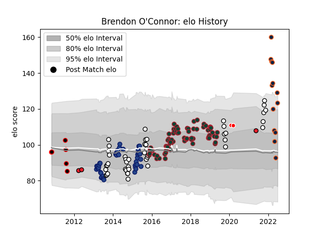

---  
layout: page  
title: Brendon O'Connor  
date: 2023-03-02 11:26:58.019673  
categories: player  
---
# Brendon O'Connor

## Positions: FL

## Current elo: 123.0

## Current Percentile: 95.0

# Elo History

# Match History

| Team             |   Appearances |   Win Rate |
|:-----------------|--------------:|-----------:|
| Leicester Tigers |            73 |   0.506849 |
| Hawke's Bay      |            45 |   0.644444 |
| Blues            |            42 |   0.285714 |
| R.U. New York    |            13 |   0.692308 |
| Rugby New York   |            13 |   0.692308 |
| Canterbury       |             6 |   0.666667 |
| Crusaders        |             3 |   1        |
| Sunwolves        |             2 |   0.5      |

| Opponent                 |   Matches |   Win Rate |
|:-------------------------|----------:|-----------:|
| Bay of Plenty            |         7 |   0.428571 |
| Wellington               |         7 |   0.785714 |
| Tasman                   |         7 |   0.285714 |
| Saracens                 |         7 |   0.142857 |
| Bath Rugby               |         6 |   0.333333 |
| Highlanders              |         6 |   0.333333 |
| Harlequins               |         6 |   0.666667 |
| Chiefs                   |         6 |   0        |
| Newcastle Falcons        |         6 |   0.833333 |
| Crusaders                |         6 |   0.333333 |
| New England Free Jacks   |         5 |   0.2      |
| Northampton Saints       |         5 |   0.6      |
| Hurricanes               |         5 |   0.4      |
| Gloucester Rugby         |         5 |   0.8      |
| Exeter Chiefs            |         5 |   0.2      |
| Otago                    |         5 |   1        |
| Racing 92                |         5 |   0.2      |
| Northland                |         4 |   0.75     |
| Manawatu                 |         4 |   0.25     |
| Rugby ATL                |         4 |   0.5      |
| Sale Sharks              |         4 |   0.75     |
| Seattle Seawolves        |         4 |   1        |
| Waikato                  |         4 |   0.75     |
| Munster                  |         4 |   0.75     |
| Worcester Warriors       |         4 |   0.75     |
| Brumbies                 |         4 |   0.5      |
| Melbourne Rebels         |         3 |   0.666667 |
| Wasps                    |         3 |   0        |
| NOLA Gold                |         3 |   1        |
| Toronto Arrows           |         3 |   0.333333 |
| Old Glory DC             |         3 |   1        |
| Counties Manukau         |         3 |   0.666667 |
| Cheetahs                 |         3 |   0.333333 |
| Bulls                    |         3 |   0.333333 |
| San Diego Legion         |         2 |   1        |
| Ulster                   |         2 |   0        |
| Bristol Rugby            |         2 |   0.5      |
| Taranaki                 |         2 |   1        |
| Stormers                 |         2 |   0.5      |
| Stade Francais Paris     |         2 |   1        |
| Southland                |         2 |   0.75     |
| Auckland                 |         2 |   1        |
| Canterbury               |         2 |   0.5      |
| Castres Olympique        |         2 |   0.5      |
| Queensland Reds          |         2 |   0.5      |
| North Harbour            |         2 |   1        |
| New South Wales Waratahs |         2 |   0        |
| Lions                    |         2 |   0        |
| Scarlets                 |         1 |   0        |
| Sharks                   |         1 |   0        |
| Dallas Jackals           |         1 |   1        |
| Dragons                  |         1 |   1        |
| Glasgow Warriors         |         1 |   0        |
| Houston SaberCats        |         1 |   1        |
| Blues                    |         1 |   1        |
| Benetton Treviso         |         1 |   1        |
| Western Force            |         1 |   1        |
| London Irish             |         1 |   1        |