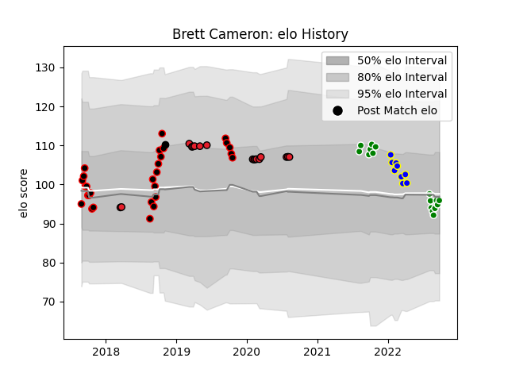

---  
layout: page  
title: Brett Cameron  
date: 2023-03-12 11:33:26.077391  
categories: player  
---
# Brett Cameron

## Positions: FH

## Country: New Zealand

## Current elo: 96.0

## Current Percentile: 45.0

# Elo History

# Match History

| Team              |   Appearances |   Win Rate |
|:------------------|--------------:|-----------:|
| Canterbury        |            28 |   0.75     |
| Crusaders         |            17 |   0.735294 |
| Manawatu          |            16 |   0.25     |
| Kamaishi Seawaves |             9 |   0.111111 |
| New Zealand       |             1 |   1        |

| Opponent                 |   Matches |   Win Rate |
|:-------------------------|----------:|-----------:|
| Otago                    |         5 |   0.8      |
| North Harbour            |         5 |   0.8      |
| Auckland                 |         4 |   0.25     |
| Counties Manukau         |         4 |   0.75     |
| Tasman                   |         4 |   0.5      |
| Hawke's Bay              |         4 |   0.5      |
| Wellington               |         4 |   0.25     |
| Chiefs                   |         3 |   0.666667 |
| Highlanders              |         3 |   0.666667 |
| Taranaki                 |         3 |   0.333333 |
| Skyactivs Hiroshima      |         2 |   0.5      |
| Canterbury               |         2 |   0        |
| Hino Red Dolphins        |         2 |   0        |
| Hurricanes               |         2 |   0.5      |
| Waikato                  |         2 |   0.5      |
| Manawatu                 |         2 |   0.5      |
| Mie Honda Heat           |         2 |   0        |
| New South Wales Waratahs |         2 |   0.5      |
| Hanazono Kintetsu Liners |         2 |   0        |
| Northland                |         2 |   1        |
| Southland                |         2 |   1        |
| Blues                    |         1 |   1        |
| Sunwolves                |         1 |   1        |
| Bulls                    |         1 |   1        |
| Sharks                   |         1 |   0.5      |
| Queensland Reds          |         1 |   1        |
| Brumbies                 |         1 |   1        |
| Mitsubishi Dynaboars     |         1 |   0        |
| Bay of Plenty            |         1 |   1        |
| Japan                    |         1 |   1        |
| Melbourne Rebels         |         1 |   1        |