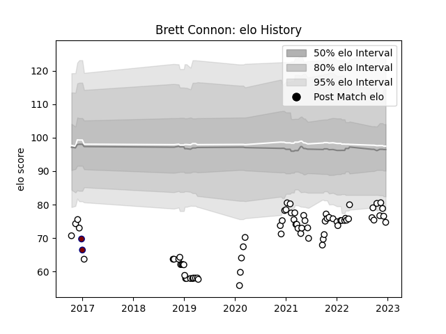

---  
layout: page  
title: Brett Connon  
date: 2022-12-09 13:06:59.345950  
categories: player  
---
# Brett Connon

## Positions: FH

## Current elo: 77.0

## Current Percentile: 5.0

# Elo History

# Match History

| Team              |   Appearances |   Win Rate |
|:------------------|--------------:|-----------:|
| Newcastle Falcons |            71 |   0.408451 |
| Rotherham Titans  |             2 |   0        |

| Opponent            |   Matches |   Win Rate |
|:--------------------|----------:|-----------:|
| Bath Rugby          |         7 |   0.428571 |
| Harlequins          |         6 |   0.166667 |
| Gloucester Rugby    |         6 |   0.333333 |
| Wasps               |         5 |   0.6      |
| Bristol Rugby       |         5 |   0.2      |
| Northampton Saints  |         5 |   0.6      |
| Worcester Warriors  |         4 |   0.75     |
| London Irish        |         4 |   0.25     |
| Saracens            |         4 |   0        |
| Leicester Tigers    |         4 |   0        |
| Exeter Chiefs       |         3 |   0.666667 |
| Sale Sharks         |         3 |   0.666667 |
| Edinburgh           |         2 |   0        |
| Toulon              |         2 |   0.5      |
| Montpellier Herault |         2 |   0.5      |
| Ospreys             |         1 |   0        |
| Lyon                |         1 |   0        |
| Ampthill            |         1 |   1        |
| London Scottish     |         1 |   0        |
| Hartpury College    |         1 |   1        |
| Grenoble            |         1 |   0        |
| Doncaster           |         1 |   0        |
| Cornish Pirates     |         1 |   1        |
| Castres Olympique   |         1 |   1        |
| Bedford             |         1 |   1        |
| Jersey              |         1 |   1        |