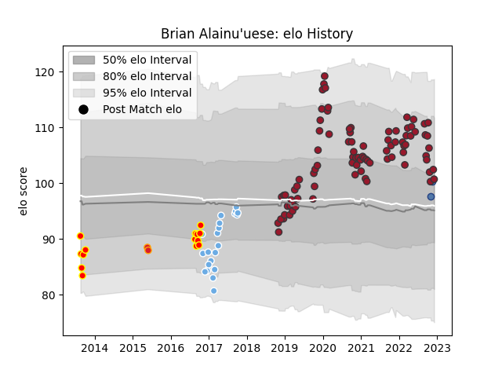

---  
layout: page  
title: Brian Alainu'uese  
date: 2023-01-06 00:21:30.748053  
categories: player  
---
# Brian Alainu'uese

## Positions: L

## Country: Samoa

## Current elo: 112.0

## Current Percentile: 82.0

# Elo History

# Match History

| Team             |   Appearances |   Win Rate |
|:-----------------|--------------:|-----------:|
| Toulon           |            92 |   0.565217 |
| Glasgow Warriors |            22 |   0.636364 |
| Waikato          |            14 |   0.607143 |
| Chiefs           |             2 |   0.5      |
| Samoa            |             2 |   0.5      |

| Opponent             |   Matches |   Win Rate |
|:---------------------|----------:|-----------:|
| Racing 92            |         9 |   0.555556 |
| La Rochelle          |         9 |   0.222222 |
| Stade Toulousain     |         7 |   0.357143 |
| Stade Francais Paris |         7 |   0.714286 |
| Bayonne              |         7 |   0.571429 |
| Lyon                 |         7 |   0.571429 |
| Brive                |         6 |   0.5      |
| Montpellier Herault  |         6 |   0.333333 |
| Bordeaux Begles      |         6 |   0.5      |
| Pau                  |         6 |   0.916667 |
| Perpignan            |         5 |   0.6      |
| Clermont Auvergne    |         5 |   1        |
| Scarlets             |         4 |   0.5      |
| Benetton Treviso     |         3 |   1        |
| Ospreys              |         3 |   0.333333 |
| Castres Olympique    |         3 |   0.666667 |
| Agen                 |         2 |   0.5      |
| Munster              |         2 |   0.5      |
| Auckland             |         2 |   1        |
| Leicester Tigers     |         2 |   1        |
| Canterbury           |         2 |   0        |
| Grenoble             |         2 |   0.5      |
| Hawke's Bay          |         1 |   1        |
| Wellington           |         1 |   1        |
| Ulster               |         1 |   0        |
| Tasman               |         1 |   0        |
| Taranaki             |         1 |   0.5      |
| Bath Rugby           |         1 |   1        |
| Bay of Plenty        |         1 |   1        |
| Southland            |         1 |   0        |
| Biarritz Olympique   |         1 |   1        |
| Saracens             |         1 |   0        |
| Romania              |         1 |   1        |
| Bristol Rugby        |         1 |   0        |
| Bulls                |         1 |   1        |
| Otago                |         1 |   0        |
| Highlanders          |         1 |   0        |
| Cardiff Blues        |         1 |   1        |
| Northland            |         1 |   1        |
| North Harbour        |         1 |   1        |
| Cheetahs             |         1 |   1        |
| Connacht             |         1 |   1        |
| Manawatu             |         1 |   1        |
| Dragons              |         1 |   1        |
| London Irish         |         1 |   1        |
| Leinster             |         1 |   0        |
| Edinburgh            |         1 |   1        |
| Italy                |         1 |   0        |
| Zebre                |         1 |   1        |