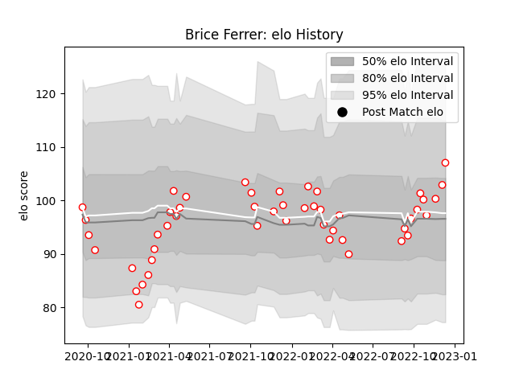

---  
layout: page  
title: Brice Ferrer  
date: 2023-03-17 17:04:01.208936  
categories: player  
---
# Brice Ferrer

## Positions: N8, FL

## Country: Spain

## Current elo: 79.0

## Current Percentile: 13.0

# Elo History

# Match History

| Team   |   Appearances |   Win Rate |
|:-------|--------------:|-----------:|
| Dax    |            61 |   0.57377  |
| Spain  |             6 |   0.333333 |

| Opponent                   |   Matches |   Win Rate |
|:---------------------------|----------:|-----------:|
| Albi                       |         6 |   0.166667 |
| Blagnac                    |         6 |   0.5      |
| Chambery                   |         6 |   0.833333 |
| Bourgoin-Jallieu           |         5 |   0.6      |
| Cognac Saint Jean d'Angély |         5 |   0.4      |
| Nice                       |         5 |   0.8      |
| Dijon                      |         4 |   0.75     |
| Tarbes                     |         4 |   0.75     |
| Suresnes                   |         4 |   0.5      |
| Narbonne                   |         3 |   0.666667 |
| US Bressane                |         3 |   0.666667 |
| Valence Romans Drome Rugby |         3 |   0.666667 |
| Aubenas                    |         3 |   0.666667 |
| Soyaux-Angouleme           |         2 |   0.5      |
| Massy                      |         2 |   0        |
| Netherlands                |         1 |   1        |
| Romania                    |         1 |   0        |
| Georgia                    |         1 |   0        |
| Tonga                      |         1 |   0        |
| Fiji                       |         1 |   0        |
| Namibia                    |         1 |   1        |