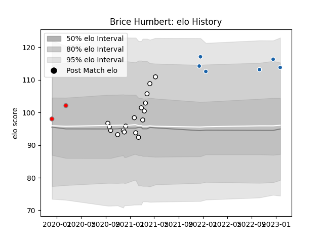

---  
layout: page  
title: Brice Humbert  
date: 2023-02-02 18:40:05.891493  
categories: player  
---
# Brice Humbert

## Positions: H

## Current elo: 113.0

## Current Percentile: None

# Elo History

# Match History

| Team                       |   Appearances |   Win Rate |
|:---------------------------|--------------:|-----------:|
| Valence Romans Drome Rugby |            17 |   0.294118 |
| Castres Olympique          |             7 |   0.285714 |
| Roval Drome XV             |             2 |   0        |

| Opponent            |   Matches |   Win Rate |
|:--------------------|----------:|-----------:|
| Soyaux-Angouleme    |         3 |   0.166667 |
| Carcassonne         |         2 |   1        |
| Provence Rugby      |         2 |   0        |
| Perpignan           |         2 |   0        |
| Nevers              |         2 |   0.5      |
| Munster             |         2 |   0        |
| Aurillac            |         1 |   1        |
| Montpellier Herault |         1 |   1        |
| Rouen               |         1 |   0        |
| Oyonnax             |         1 |   0        |
| Mont-de-Marsan      |         1 |   0.5      |
| Beziers             |         1 |   0        |
| Harlequins          |         1 |   0        |
| Exeter Chiefs       |         1 |   0        |
| Edinburgh           |         1 |   0        |
| Colomiers           |         1 |   0        |
| Bordeaux Begles     |         1 |   1        |
| Biarritz Olympique  |         1 |   0        |
| Vannes              |         1 |   0        |