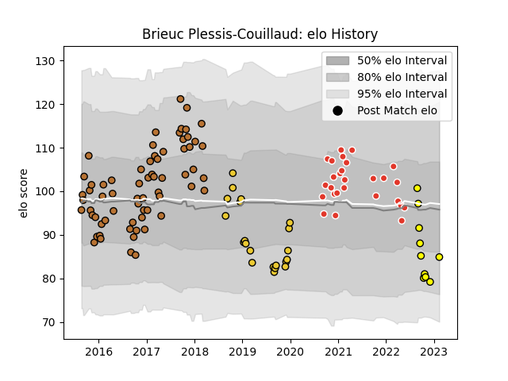

---  
layout: page  
title: Brieuc Plessis-Couillaud  
date: 2023-02-15 22:12:14.041592  
categories: player  
---
# Brieuc Plessis-Couillaud

## Positions: C

## Current elo: 85.0

## Current Percentile: 13.0

# Elo History

# Match History

| Team               |   Appearances |   Win Rate |
|:-------------------|--------------:|-----------:|
| Narbonne           |            66 |   0.462121 |
| Biarritz Olympique |            27 |   0.481481 |
| La Rochelle        |            21 |   0.571429 |
| Carcassonne        |            10 |   0.3      |

| Opponent                   |   Matches |   Win Rate |
|:---------------------------|----------:|-----------:|
| Aurillac                   |         8 |   0.5      |
| Carcassonne                |         7 |   0.571429 |
| Colomiers                  |         7 |   0.5      |
| Mont-de-Marsan             |         7 |   0.5      |
| Perpignan                  |         6 |   0.333333 |
| Montauban                  |         6 |   0.5      |
| Vannes                     |         5 |   0.4      |
| Beziers                    |         5 |   0.6      |
| Biarritz Olympique         |         5 |   0.2      |
| Agen                       |         4 |   0.5      |
| Soyaux-Angouleme           |         4 |   0.5      |
| Provence Rugby             |         4 |   0.625    |
| Oyonnax                    |         4 |   0.5      |
| Dax                        |         4 |   0.75     |
| Albi                       |         3 |   0.5      |
| Montpellier Herault        |         3 |   0.333333 |
| Zebre                      |         3 |   1        |
| Grenoble                   |         3 |   0.5      |
| Bayonne                    |         3 |   0        |
| Castres Olympique          |         3 |   0.333333 |
| Bourgoin-Jallieu           |         3 |   1        |
| Massy                      |         2 |   0.5      |
| Glasgow Warriors           |         2 |   0.5      |
| Clermont Auvergne          |         2 |   0        |
| Nevers                     |         2 |   0        |
| Pau                        |         2 |   0.5      |
| Lyon                       |         2 |   0        |
| Racing 92                  |         2 |   0        |
| Tarbes                     |         2 |   0.5      |
| Stade Toulousain           |         2 |   0.5      |
| Stade Francais Paris       |         1 |   1        |
| Valence Romans Drome Rugby |         1 |   1        |
| La Rochelle                |         1 |   0        |
| Bordeaux Begles            |         1 |   0        |
| Sale Sharks                |         1 |   0        |
| Rouen                      |         1 |   1        |
| Bristol Rugby              |         1 |   0        |
| Enisey-STM Krasnoyarsk     |         1 |   1        |
| RC Enisei                  |         1 |   1        |