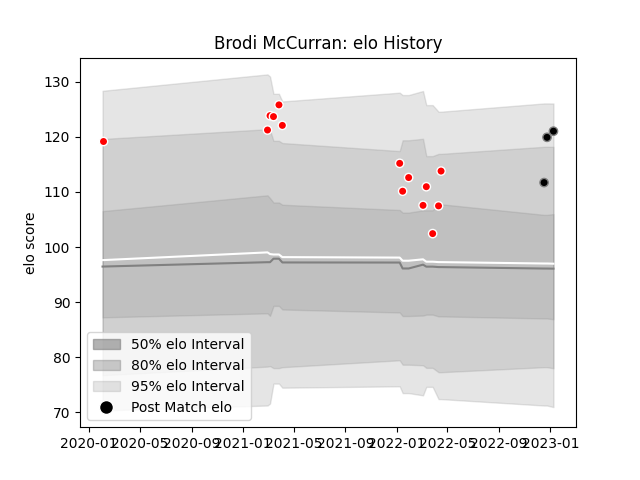

---  
layout: page  
title: Brodi McCurran  
date: 2023-03-17 17:27:06.583153  
categories: player  
---
# Brodi McCurran

## Positions: FL, N8

## Current elo: 122.0

## Current Percentile: 97.0

# Elo History

# Match History

| Team                  |   Appearances |   Win Rate |
|:----------------------|--------------:|-----------:|
| Kobelco Kobe Steelers |            14 |   0.535714 |
| Black Rams Tokyo      |            11 |   0.454545 |

| Opponent                          |   Matches |   Win Rate |
|:----------------------------------|----------:|-----------:|
| Saitama Wild Knights              |         4 |   0.125    |
| Yokohama Canon Eagles             |         3 |   0.333333 |
| Black Rams Tokyo                  |         2 |   1        |
| Green Rockets Tokatsu             |         2 |   1        |
| Shizuoka Blue Revs                |         2 |   1        |
| Tokyo Sungoliath                  |         2 |   0        |
| Toshiba Brave Lupus Tokyo         |         2 |   0        |
| Hanazono Kintetsu Liners          |         1 |   1        |
| Hino Red Dolphins                 |         1 |   1        |
| Kobelco Kobe Steelers             |         1 |   1        |
| Kubota Spears Funabashi Tokyo-Bay |         1 |   0        |
| Mitsubishi Dynaboars              |         1 |   0        |
| NTT Docomo Red Hurricanes Osaka   |         1 |   1        |
| Toyota Verblitz                   |         1 |   1        |
| Urayasu D-Rocks                   |         1 |   0        |