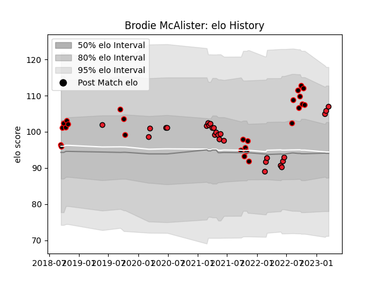

---  
layout: page  
title: Brodie McAlister  
date: 2023-03-21 18:25:01.637049  
categories: player  
---
# Brodie McAlister

Last updated: 2023-03-21
## Positions: H

## Current elo: 107.0

## Current Percentile: 83.0

# Elo History

# Match History

| Team       |   Appearances |   Win Rate |
|:-----------|--------------:|-----------:|
| Crusaders  |            27 |   0.888889 |
| Canterbury |            26 |   0.730769 |

| Opponent         |   Matches |   Win Rate |
|:-----------------|----------:|-----------:|
| Chiefs           |         6 |   0.666667 |
| Blues            |         5 |   1        |
| Hurricanes       |         4 |   1        |
| Queensland Reds  |         4 |   1        |
| Otago            |         4 |   0.75     |
| Highlanders      |         4 |   0.75     |
| Auckland         |         3 |   0.333333 |
| Northland        |         3 |   1        |
| Wellington       |         3 |   0.333333 |
| Bay of Plenty    |         2 |   1        |
| North Harbour    |         2 |   1        |
| Hawke's Bay      |         2 |   0.5      |
| Counties Manukau |         2 |   1        |
| Tasman           |         2 |   1        |
| Manawatu         |         1 |   1        |
| Moana Pasifika   |         1 |   1        |
| Brumbies         |         1 |   1        |
| Southland        |         1 |   1        |
| Sunwolves        |         1 |   1        |
| Waikato          |         1 |   0        |
| Melbourne Rebels |         1 |   1        |