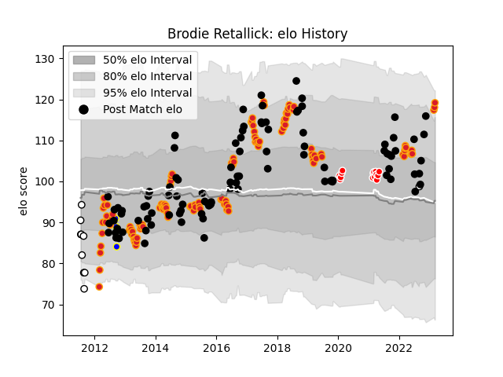

---  
layout: page  
title: Brodie Retallick  
date: 2023-03-17 17:29:04.091266  
categories: player  
---
# Brodie Retallick

## Positions: L

## Country: New Zealand

## Current elo: 119.0

## Current Percentile: 92.0

# Elo History

# Match History

| Team                  |   Appearances |   Win Rate |
|:----------------------|--------------:|-----------:|
| Chiefs                |           119 |   0.663866 |
| New Zealand           |           101 |   0.876238 |
| Kobelco Kobe Steelers |            15 |   0.9      |
| Hawke's Bay           |            10 |   0.6      |
| Bay of Plenty         |             3 |   0.333333 |

| Opponent                          |   Matches |   Win Rate |
|:----------------------------------|----------:|-----------:|
| Australia                         |        27 |   0.925926 |
| Crusaders                         |        21 |   0.52381  |
| Argentina                         |        15 |   1        |
| Hurricanes                        |        14 |   0.535714 |
| Highlanders                       |        13 |   0.538462 |
| Blues                             |        13 |   0.884615 |
| South Africa                      |        13 |   0.884615 |
| Ireland                           |        10 |   0.6      |
| England                           |         9 |   0.722222 |
| Wales                             |         7 |   1        |
| New South Wales Waratahs          |         7 |   0.571429 |
| Brumbies                          |         6 |   0.5      |
| Stormers                          |         6 |   0.666667 |
| Western Force                     |         5 |   0.8      |
| Queensland Reds                   |         5 |   0.6      |
| Melbourne Rebels                  |         5 |   1        |
| France                            |         5 |   0.8      |
| Bulls                             |         5 |   0.9      |
| Cheetahs                          |         4 |   0.875    |
| Sharks                            |         4 |   1        |
| Moana Pasifika                    |         3 |   1        |
| British and Irish Lions           |         3 |   0.5      |
| Italy                             |         3 |   1        |
| Shizuoka Blue Revs                |         2 |   1        |
| Samoa                             |         2 |   1        |
| Counties Manukau                  |         2 |   0.5      |
| Sunwolves                         |         2 |   0.5      |
| North Harbour                     |         2 |   1        |
| Fiji                              |         2 |   1        |
| NTT Docomo Red Hurricanes Osaka   |         2 |   1        |
| Yokohama Canon Eagles             |         2 |   1        |
| Manawatu                          |         2 |   0.5      |
| Lions                             |         2 |   0.5      |
| Jaguares                          |         2 |   0        |
| Black Rams Tokyo                  |         2 |   1        |
| Southern Kings                    |         1 |   1        |
| Taranaki                          |         1 |   0        |
| Tokyo Sungoliath                  |         1 |   1        |
| Tonga                             |         1 |   1        |
| Toshiba Brave Lupus Tokyo         |         1 |   1        |
| Southland                         |         1 |   1        |
| United States of America          |         1 |   1        |
| Tasman                            |         1 |   0        |
| Green Rockets Tokatsu             |         1 |   1        |
| Saitama Wild Knights              |         1 |   0.5      |
| Hawke's Bay                       |         1 |   0        |
| Northland                         |         1 |   0        |
| Namibia                           |         1 |   1        |
| Mitsubishi Dynaboars              |         1 |   1        |
| Auckland                          |         1 |   1        |
| Kubota Spears Funabashi Tokyo-Bay |         1 |   0        |
| Japan                             |         1 |   1        |
| Fijian Drua                       |         1 |   1        |
| Hino Red Dolphins                 |         1 |   1        |
| Georgia                           |         1 |   1        |
| Otago                             |         1 |   1        |