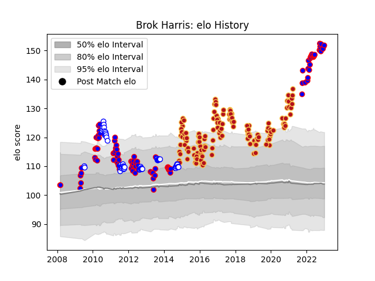

---  
layout: page  
title: Brok Harris  
date: 2023-02-02 18:54:21.519538  
categories: player  
---
# Brok Harris

## Positions: P

## Current elo: 133.0

## Current Percentile: 99.0

# Elo History

# Match History

| Team             |   Appearances |   Win Rate |
|:-----------------|--------------:|-----------:|
| Dragons          |           138 |   0.365942 |
| Stormers         |           103 |   0.694175 |
| Western Province |            61 |   0.680328 |

| Opponent                 |   Matches |   Win Rate |
|:-------------------------|----------:|-----------:|
| Leinster                 |        13 |  0.307692  |
| Ulster                   |        13 |  0.269231  |
| Ospreys                  |        13 |  0.307692  |
| Cardiff Blues            |        13 |  0.230769  |
| Edinburgh                |        12 |  0.458333  |
| Blue Bulls               |        12 |  0.625     |
| Glasgow Warriors         |        12 |  0.333333  |
| Scarlets                 |        11 |  0.454545  |
| Natal Sharks             |        11 |  0.454545  |
| Munster                  |        11 |  0.0909091 |
| Bulls                    |        11 |  0.727273  |
| Golden Lions             |        11 |  0.5       |
| Lions                    |        10 |  0.9       |
| Zebre                    |        10 |  0.7       |
| Connacht                 |        10 |  0.3       |
| Griquas                  |         9 |  0.944444  |
| Sharks                   |         8 |  0.5625    |
| Free State Cheetahs      |         8 |  0.625     |
| Cheetahs                 |         8 |  0.75      |
| Benetton Treviso         |         7 |  0.571429  |
| Queensland Reds          |         6 |  0.5       |
| Crusaders                |         6 |  0.166667  |
| Western Force            |         5 |  0.8       |
| Southern Kings           |         5 |  0.9       |
| Pumas                    |         5 |  1         |
| Chiefs                   |         4 |  0.25      |
| Highlanders              |         4 |  1         |
| Hurricanes               |         4 |  0.75      |
| Worcester Warriors       |         4 |  0.5       |
| Leopards                 |         4 |  1         |
| New South Wales Waratahs |         4 |  0.75      |
| Blues                    |         3 |  1         |
| Melbourne Rebels         |         3 |  0.666667  |
| Brumbies                 |         3 |  0.333333  |
| Newcastle Falcons        |         3 |  0.333333  |
| Pau                      |         2 |  1         |
| Sale Sharks              |         2 |  0.5       |
| Clermont Auvergne        |         2 |  0.5       |
| Northampton Saints       |         2 |  0         |
| Dragons                  |         2 |  1         |
| London Irish             |         2 |  1         |
| Castres Olympique        |         2 |  1         |
| Bucuresti                |         2 |  1         |
| Brive                    |         1 |  1         |
| Harlequins               |         1 |  0         |
| RC Enisei                |         1 |  1         |
| Montpellier Herault      |         1 |  0         |
| Bristol Rugby            |         1 |  0         |
| Eastern Province Kings   |         1 |  1         |
| London Welsh             |         1 |  1         |
| Stade Francais Paris     |         1 |  1         |
| Timisoara Saracens       |         1 |  1         |
| Gloucester Rugby         |         1 |  1         |