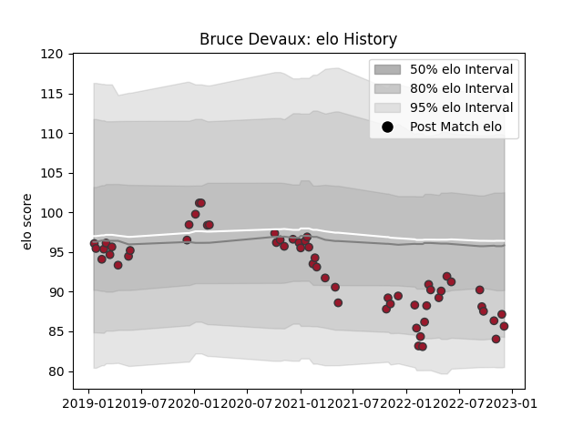

---  
layout: page  
title: Bruce Devaux  
date: 2023-02-02 18:38:47.742511  
categories: player  
---
# Bruce Devaux

## Positions: P

## Current elo: 85.0

## Current Percentile: 38.0

# Elo History

# Match History

| Team   |   Appearances |   Win Rate |
|:-------|--------------:|-----------:|
| Toulon |            69 |   0.543478 |

| Opponent             |   Matches |   Win Rate |
|:---------------------|----------:|-----------:|
| Brive                |         6 |   0.333333 |
| Stade Francais Paris |         6 |   0.5      |
| Pau                  |         5 |   0.9      |
| Clermont Auvergne    |         5 |   0.8      |
| Lyon                 |         5 |   0.2      |
| Montpellier Herault  |         5 |   0.2      |
| Bayonne              |         4 |   0.5      |
| Bordeaux Begles      |         4 |   0.5      |
| Castres Olympique    |         4 |   0.75     |
| La Rochelle          |         4 |   0.25     |
| Stade Toulousain     |         3 |   0.333333 |
| Racing 92            |         3 |   0.333333 |
| Perpignan            |         3 |   0.666667 |
| Agen                 |         2 |   0.5      |
| London Irish         |         2 |   1        |
| Bath Rugby           |         2 |   1        |
| Biarritz Olympique   |         2 |   1        |
| Zebre                |         2 |   1        |
| Newcastle Falcons    |         1 |   1        |
| Grenoble             |         1 |   0        |