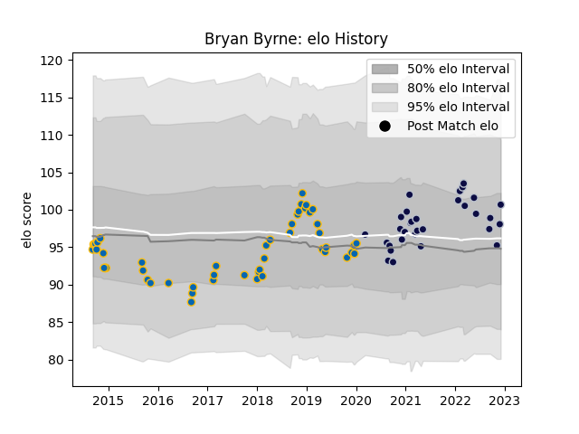

---  
layout: page  
title: Bryan Byrne  
date: 2023-03-21 18:40:49.862394  
categories: player  
---
# Bryan Byrne

Last updated: 2023-03-21
## Positions: H

## Current elo: 108.0

## Current Percentile: 78.0

# Elo History

# Match History

| Team          |   Appearances |   Win Rate |
|:--------------|--------------:|-----------:|
| Leinster      |            50 |   0.73     |
| Bristol Rugby |            38 |   0.671053 |

| Opponent            |   Matches |   Win Rate |
|:--------------------|----------:|-----------:|
| Harlequins          |         7 |   0.714286 |
| Scarlets            |         7 |   0.785714 |
| Edinburgh           |         7 |   0.571429 |
| Glasgow Warriors    |         6 |   0.5      |
| Bath Rugby          |         5 |   0.8      |
| Wasps               |         5 |   0.6      |
| Connacht            |         5 |   0.8      |
| Benetton Treviso    |         5 |   0.8      |
| Sale Sharks         |         4 |   0.25     |
| Northampton Saints  |         4 |   1        |
| Zebre               |         4 |   1        |
| Exeter Chiefs       |         4 |   0.5      |
| Munster             |         3 |   0.333333 |
| Cardiff Blues       |         3 |   1        |
| Leicester Tigers    |         2 |   0.75     |
| Dragons             |         2 |   1        |
| Ospreys             |         2 |   1        |
| Saracens            |         2 |   0.5      |
| Southern Kings      |         2 |   1        |
| Ulster              |         2 |   0.5      |
| Worcester Warriors  |         2 |   1        |
| Gloucester Rugby    |         1 |   1        |
| Newcastle Falcons   |         1 |   1        |
| Clermont Auvergne   |         1 |   0        |
| Bordeaux Begles     |         1 |   0        |
| Montpellier Herault |         1 |   1        |