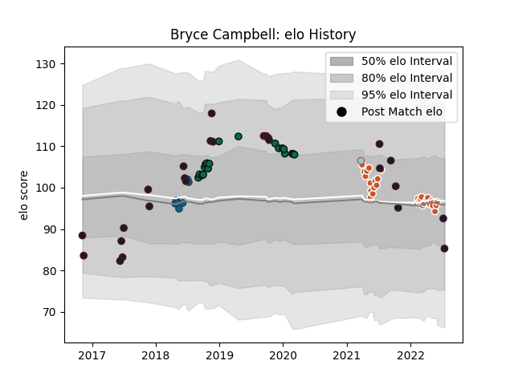

---  
layout: page  
title: Bryce Campbell  
date: 2023-03-09 10:13:52.807439  
categories: player  
---
# Bryce Campbell

## Positions: C

## Country: United States of America

## Current elo: 85.0

## Current Percentile: 40.0

# Elo History

# Match History

| Team                     |   Appearances |   Win Rate |
|:-------------------------|--------------:|-----------:|
| Austin Gilgronis         |            29 |   0.689655 |
| United States of America |            26 |   0.403846 |
| London Irish             |            19 |   0.578947 |
| Glendale Raptors         |             7 |   0.857143 |
| Austin Herd              |             1 |   0        |

| Opponent               |   Matches |   Win Rate |
|:-----------------------|----------:|-----------:|
| Seattle Seawolves      |         6 |   0.833333 |
| Utah Warriors          |         6 |   0.5      |
| Canada                 |         5 |   0.9      |
| San Diego Legion       |         5 |   0.8      |
| NOLA Gold              |         3 |   1        |
| L. A. Giltinis         |         3 |   0.333333 |
| Ireland                |         3 |   0        |
| Houston SaberCats      |         3 |   1        |
| New England Free Jacks |         2 |   0        |
| Romania                |         2 |   0.5      |
| Rugby ATL              |         2 |   0.5      |
| Georgia                |         2 |   0        |
| England                |         2 |   0        |
| Chile                  |         2 |   0.5      |
| Old Glory DC           |         2 |   0.5      |
| Scarlets               |         1 |   0        |
| Tonga                  |         1 |   0        |
| Samoa                  |         1 |   1        |
| Toronto Arrows         |         1 |   1        |
| Toulon                 |         1 |   0        |
| Scotland               |         1 |   1        |
| Uruguay                |         1 |   0        |
| Russia                 |         1 |   1        |
| R.U. New York          |         1 |   1        |
| Rugby New York         |         1 |   1        |
| Wasps                  |         1 |   0        |
| Worcester Warriors     |         1 |   0        |
| Richmond               |         1 |   1        |
| Sale Sharks            |         1 |   0        |
| Argentina              |         1 |   0        |
| Nottingham             |         1 |   1        |
| Exeter Chiefs          |         1 |   0        |
| Bayonne                |         1 |   0        |
| Bedford                |         1 |   1        |
| Cornish Pirates        |         1 |   1        |
| Coventry               |         1 |   1        |
| Dallas Jackals         |         1 |   1        |
| Doncaster              |         1 |   1        |
| Ealing Trailfinders    |         1 |   1        |
| France                 |         1 |   0        |
| New Zealand Maori      |         1 |   0        |
| Germany                |         1 |   1        |
| Gloucester Rugby       |         1 |   1        |
| Hartpury College       |         1 |   1        |
| Jersey                 |         1 |   0        |
| London Scottish        |         1 |   1        |
| Austin Elite Rugby     |         1 |   1        |
| New Zealand            |         1 |   0        |
| Yorkshire Carnegie     |         1 |   1        |