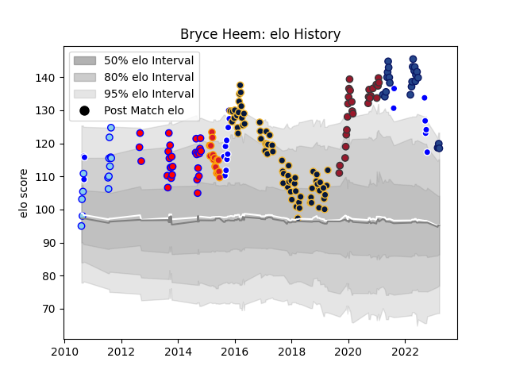

---  
layout: page  
title: Bryce Heem  
date: 2023-03-21 18:54:11.512637  
categories: player  
---
# Bryce Heem

Last updated: 2023-03-21
## Positions: W, C

## Current elo: 118.0

## Current Percentile: 90.0

# Elo History

# Match History

| Team               |   Appearances |   Win Rate |
|:-------------------|--------------:|-----------:|
| Worcester Warriors |            67 |   0.343284 |
| Tasman             |            27 |   0.722222 |
| Toulon             |            26 |   0.711538 |
| Blues              |            24 |   0.791667 |
| Auckland           |            20 |   0.625    |
| Chiefs             |            16 |   0.625    |
| Northland          |            14 |   0.428571 |

| Opponent                 |   Matches |   Win Rate |
|:-------------------------|----------:|-----------:|
| Highlanders              |         8 |   0.625    |
| Leicester Tigers         |         8 |   0.5      |
| Canterbury               |         8 |   0.5      |
| Harlequins               |         7 |   0.428571 |
| Exeter Chiefs            |         7 |   0.142857 |
| Taranaki                 |         7 |   0.428571 |
| Newcastle Falcons        |         7 |   0.428571 |
| London Irish             |         6 |   0.666667 |
| Sale Sharks              |         6 |   0.333333 |
| Wasps                    |         6 |   0        |
| Crusaders                |         6 |   0.5      |
| Hawke's Bay              |         5 |   0.8      |
| Saracens                 |         5 |   0.2      |
| Southland                |         5 |   0.9      |
| Tasman                   |         5 |   0.8      |
| Wellington               |         5 |   0.4      |
| Bath Rugby               |         5 |   0.2      |
| Northampton Saints       |         5 |   0.2      |
| Manawatu                 |         4 |   0.75     |
| Otago                    |         4 |   1        |
| Brumbies                 |         4 |   0.75     |
| Counties Manukau         |         4 |   0.5      |
| Gloucester Rugby         |         4 |   0.5      |
| Waikato                  |         4 |   0.75     |
| North Harbour            |         3 |   0        |
| Queensland Reds          |         3 |   1        |
| Northland                |         3 |   0.666667 |
| Scarlets                 |         3 |   1        |
| Melbourne Rebels         |         3 |   0.666667 |
| Western Force            |         3 |   1        |
| Lyon                     |         3 |   0.333333 |
| Hurricanes               |         3 |   0.333333 |
| Bristol Rugby            |         3 |   0.666667 |
| Stade Francais Paris     |         2 |   1        |
| Bay of Plenty            |         2 |   1        |
| Auckland                 |         2 |   0.25     |
| Clermont Auvergne        |         2 |   1        |
| Chiefs                   |         2 |   1        |
| Pau                      |         2 |   1        |
| Blues                    |         2 |   1        |
| Racing 92                |         2 |   1        |
| Stade Toulousain         |         2 |   0.25     |
| Brive                    |         2 |   0.5      |
| Bayonne                  |         1 |   1        |
| Bordeaux Begles          |         1 |   0        |
| Stormers                 |         1 |   1        |
| Cardiff Blues            |         1 |   1        |
| Sharks                   |         1 |   0        |
| Bulls                    |         1 |   1        |
| Moana Pasifika           |         1 |   1        |
| Castres Olympique        |         1 |   1        |
| Cheetahs                 |         1 |   1        |
| La Rochelle              |         1 |   0        |
| New South Wales Waratahs |         1 |   1        |
| Agen                     |         1 |   1        |