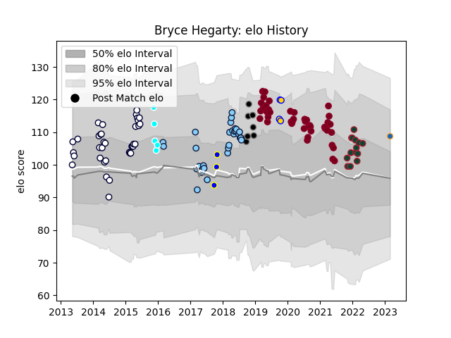

---  
layout: page  
title: Bryce Hegarty  
date: 2023-03-21 18:52:14.767136  
categories: player  
---
# Bryce Hegarty

Last updated: 2023-03-21
## Positions: FH, FB

## Current elo: 100.0

## Current Percentile: 52.0

# Elo History

# Match History

| Team                             |   Appearances |   Win Rate |
|:---------------------------------|--------------:|-----------:|
| Queensland Reds                  |            44 |   0.511364 |
| Melbourne Rebels                 |            36 |   0.388889 |
| New South Wales Waratahs         |            32 |   0.453125 |
| Leicester Tigers                 |            14 |   0.857143 |
| Black Rams Tokyo                 |             8 |   0.375    |
| Toyota Industries Shuttles Aichi |             5 |   0.4      |
| Brisbane City                    |             4 |   0.25     |
| Western Force                    |             4 |   0.5      |
| Sydney Rays                      |             3 |   0.666667 |

| Opponent                          |   Matches |   Win Rate |
|:----------------------------------|----------:|-----------:|
| Brumbies                          |        17 |   0.470588 |
| Melbourne Rebels                  |        11 |   0.772727 |
| Western Force                     |        11 |   0.545455 |
| New South Wales Waratahs          |        11 |   0.363636 |
| Queensland Reds                   |        10 |   0.6      |
| Highlanders                       |         8 |   0.375    |
| Chiefs                            |         6 |   0.333333 |
| Lions                             |         6 |   0        |
| Crusaders                         |         6 |   0.166667 |
| Sharks                            |         5 |   0.3      |
| Blues                             |         5 |   0.4      |
| Stormers                          |         4 |   0.75     |
| Hurricanes                        |         4 |   0        |
| Jaguares                          |         4 |   0        |
| Sunwolves                         |         4 |   1        |
| Bulls                             |         3 |   0.666667 |
| Shizuoka Blue Revs                |         2 |   0        |
| Saitama Wild Knights              |         2 |   0.5      |
| Queensland Country                |         2 |   0        |
| Northampton Saints                |         2 |   1        |
| Bath Rugby                        |         2 |   1        |
| Yokohama Canon Eagles             |         2 |   0.5      |
| Connacht                          |         2 |   1        |
| Harlequins                        |         2 |   0.5      |
| Coca-Cola Red Sparks              |         2 |   1        |
| Kubota Spears Funabashi Tokyo-Bay |         2 |   0        |
| Worcester Warriors                |         1 |   1        |
| Bordeaux Begles                   |         1 |   1        |
| Toyota Verblitz                   |         1 |   0        |
| Bristol Rugby                     |         1 |   1        |
| Cheetahs                          |         1 |   1        |
| Southern Kings                    |         1 |   0        |
| London Irish                      |         1 |   1        |
| Fijian Drua                       |         1 |   1        |
| Gloucester Rugby                  |         1 |   1        |
| Green Rockets Tokatsu             |         1 |   1        |
| Perth Spirit                      |         1 |   1        |
| Kobelco Kobe Steelers             |         1 |   0        |
| Moana Pasifika                    |         1 |   1        |
| Melbourne Rising                  |         1 |   1        |
| Sale Sharks                       |         1 |   0        |