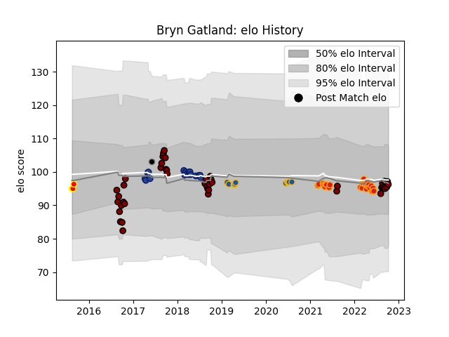

---  
layout: page  
title: Bryn Gatland  
date: 2023-03-21 18:01:10.522499  
categories: player  
---
# Bryn Gatland

Last updated: 2023-03-21
## Positions: FH

## Country: Provincial Union XV

## Current elo: 98.0

## Current Percentile: 49.0

# Elo History

# Match History

| Team                |   Appearances |   Win Rate |
|:--------------------|--------------:|-----------:|
| North Harbour       |            44 |   0.625    |
| Chiefs              |            28 |   0.678571 |
| Blues               |            17 |   0.294118 |
| Highlanders         |            10 |   0.4      |
| Waikato             |             3 |   0.666667 |
| Provincial Union XV |             1 |   0        |

| Opponent                 |   Matches |   Win Rate |
|:-------------------------|----------:|-----------:|
| Crusaders                |         9 |   0.222222 |
| Blues                    |         6 |   0.166667 |
| Hurricanes               |         5 |   0.4      |
| Tasman                   |         5 |   0.3      |
| Counties Manukau         |         5 |   1        |
| Moana Pasifika           |         5 |   1        |
| Highlanders              |         5 |   0.2      |
| Auckland                 |         4 |   0.25     |
| Waikato                  |         4 |   0.5      |
| Northland                |         4 |   1        |
| New South Wales Waratahs |         4 |   1        |
| Bay of Plenty            |         4 |   0.75     |
| Melbourne Rebels         |         4 |   0.5      |
| Chiefs                   |         4 |   0.5      |
| Canterbury               |         4 |   0        |
| Hawke's Bay              |         3 |   0.666667 |
| Wellington               |         3 |   0.333333 |
| Otago                    |         3 |   0.666667 |
| Manawatu                 |         3 |   1        |
| Southland                |         3 |   1        |
| Western Force            |         2 |   1        |
| Queensland Reds          |         2 |   1        |
| Stormers                 |         2 |   0        |
| Sunwolves                |         2 |   1        |
| Taranaki                 |         2 |   1        |
| Brumbies                 |         2 |   0.5      |
| British and Irish Lions  |         1 |   0        |
| Lions                    |         1 |   1        |
| Fijian Drua              |         1 |   1        |
| Sharks                   |         1 |   0        |