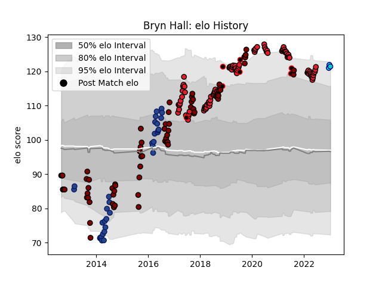

---  
layout: page  
title: Bryn Hall  
date: 2023-02-02 18:43:45.308545  
categories: player  
---
# Bryn Hall

## Positions: SH

## Country: New Zealand Maori

## Current elo: 123.0

## Current Percentile: 94.0

# Elo History

# Match History

| Team               |   Appearances |   Win Rate |
|:-------------------|--------------:|-----------:|
| Crusaders          |            94 |   0.851064 |
| North Harbour      |            72 |   0.444444 |
| Blues              |            33 |   0.530303 |
| New Zealand Maori  |             7 |   0.714286 |
| Shizuoka Blue Revs |             6 |   0.25     |

| Opponent                  |   Matches |   Win Rate |
|:--------------------------|----------:|-----------:|
| Hurricanes                |        19 |   0.684211 |
| Chiefs                    |        18 |   0.611111 |
| Highlanders               |        16 |   0.8125   |
| Blues                     |        11 |   0.909091 |
| New South Wales Waratahs  |         8 |   0.75     |
| Otago                     |         7 |   0.142857 |
| Brumbies                  |         7 |   0.857143 |
| Canterbury                |         7 |   0.142857 |
| Melbourne Rebels          |         6 |   1        |
| Northland                 |         6 |   0.75     |
| Counties Manukau          |         6 |   0.833333 |
| Manawatu                  |         6 |   0.5      |
| Southland                 |         6 |   0.5      |
| Tasman                    |         6 |   0.416667 |
| Waikato                   |         6 |   0.333333 |
| Wellington                |         6 |   0.333333 |
| Queensland Reds           |         6 |   0.916667 |
| Lions                     |         5 |   0.6      |
| Auckland                  |         5 |   0.2      |
| Hawke's Bay               |         5 |   0.6      |
| Crusaders                 |         5 |   0.4      |
| Western Force             |         5 |   1        |
| Bay of Plenty             |         4 |   0.5      |
| Bulls                     |         4 |   0.75     |
| Sharks                    |         4 |   0.625    |
| Jaguares                  |         3 |   1        |
| Stormers                  |         3 |   0.833333 |
| British and Irish Lions   |         2 |   0        |
| Taranaki                  |         2 |   1        |
| Samoa                     |         2 |   1        |
| Cheetahs                  |         2 |   1        |
| Fiji                      |         2 |   0.5      |
| Saitama Wild Knights      |         1 |   0        |
| Chile                     |         1 |   1        |
| Fijian Drua               |         1 |   1        |
| Green Rockets Tokatsu     |         1 |   1        |
| Sunwolves                 |         1 |   1        |
| Moana Pasifika            |         1 |   1        |
| Mitsubishi Dynaboars      |         1 |   0.5      |
| Toshiba Brave Lupus Tokyo |         1 |   0        |
| Toyota Verblitz           |         1 |   0        |
| Brazil                    |         1 |   1        |
| Black Rams Tokyo          |         1 |   0        |
| Southern Kings            |         1 |   1        |