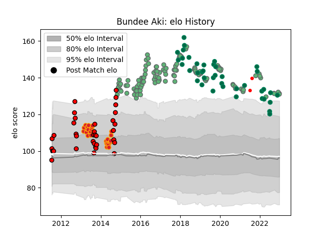

---  
layout: page  
title: Bundee Aki  
date: 2022-12-09 13:19:51.214419  
categories: player  
---
# Bundee Aki

## Positions: C

## Country: Ireland

## Current elo: 128.0

## Current Percentile: 96.0

# Elo History

# Match History

| Team                    |   Appearances |   Win Rate |
|:------------------------|--------------:|-----------:|
| Connacht                |           116 |   0.530172 |
| Ireland                 |            40 |   0.775    |
| Counties Manukau        |            32 |   0.609375 |
| Chiefs                  |            25 |   0.68     |
| British and Irish Lions |             2 |   0.5      |

| Opponent                 |   Matches |   Win Rate |
|:-------------------------|----------:|-----------:|
| Ulster                   |        12 |   0.416667 |
| Munster                  |        11 |   0.454545 |
| Leinster                 |        11 |   0.272727 |
| Glasgow Warriors         |         9 |   0.333333 |
| Cardiff Blues            |         7 |   0.571429 |
| Ospreys                  |         7 |   0.285714 |
| Zebre                    |         7 |   0.857143 |
| Scarlets                 |         6 |   0.5      |
| Wales                    |         6 |   0.833333 |
| Edinburgh                |         6 |   0.666667 |
| England                  |         6 |   0.5      |
| Scotland                 |         5 |   1        |
| Benetton Treviso         |         5 |   1        |
| New Zealand              |         5 |   0.8      |
| Tasman                   |         4 |   0.5      |
| Italy                    |         4 |   1        |
| Brive                    |         4 |   0.75     |
| Hurricanes               |         4 |   0.75     |
| France                   |         4 |   0.5      |
| Dragons                  |         4 |   0.5      |
| Crusaders                |         4 |   0.5      |
| Blues                    |         4 |   1        |
| Waikato                  |         3 |   0.333333 |
| Otago                    |         3 |   0.666667 |
| Wellington               |         3 |   0.333333 |
| Australia                |         3 |   0.666667 |
| Brumbies                 |         3 |   0.333333 |
| Manawatu                 |         3 |   0.666667 |
| Southland                |         3 |   1        |
| Gloucester Rugby         |         3 |   0.333333 |
| South Africa             |         2 |   0.5      |
| Sale Sharks              |         2 |   0.5      |
| Bordeaux Begles          |         2 |   1        |
| Southern Kings           |         2 |   1        |
| Stade Toulousain         |         2 |   0.5      |
| Taranaki                 |         2 |   0.75     |
| Wasps                    |         2 |   0.5      |
| Worcester Warriors       |         2 |   0.75     |
| RC Enisei                |         2 |   1        |
| Argentina                |         2 |   1        |
| Melbourne Rebels         |         2 |   1        |
| Canterbury               |         2 |   0        |
| Bay of Plenty            |         2 |   1        |
| Northland                |         2 |   1        |
| Hawke's Bay              |         2 |   0.5      |
| Highlanders              |         2 |   0.5      |
| Auckland                 |         2 |   0.5      |
| Montpellier Herault      |         2 |   0.5      |
| Japan                    |         2 |   1        |
| Lions                    |         2 |   1        |
| Leicester Tigers         |         2 |   0        |
| Bayonne                  |         1 |   1        |
| Western Force            |         1 |   1        |
| Cheetahs                 |         1 |   1        |
| Grenoble                 |         1 |   0        |
| Oyonnax                  |         1 |   1        |
| Stormers                 |         1 |   0        |
| Perpignan                |         1 |   1        |
| Sharks                   |         1 |   1        |
| New South Wales Waratahs |         1 |   0        |
| New Zealand Maori        |         1 |   0        |
| Samoa                    |         1 |   1        |
| Russia                   |         1 |   1        |
| Queensland Reds          |         1 |   0        |
| North Harbour            |         1 |   1        |