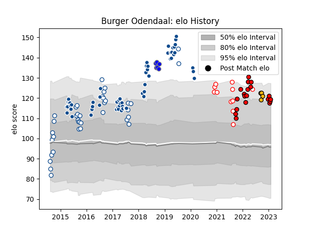

---  
layout: page  
title: Burger Odendaal  
date: 2023-01-13 11:37:45.617376  
categories: player  
---
# Burger Odendaal

## Positions: C

## Current elo: 121.0

## Current Percentile: 91.0

# Elo History

# Match History

| Team                              |   Appearances |   Win Rate |
|:----------------------------------|--------------:|-----------:|
| Bulls                             |            59 |   0.415254 |
| Blue Bulls                        |            37 |   0.594595 |
| Lions                             |            14 |   0.428571 |
| Golden Lions                      |            11 |   0.409091 |
| Kubota Spears Funabashi Tokyo-Bay |             6 |   0.666667 |
| Wasps                             |             4 |   0.25     |
| Toshiba Brave Lupus Tokyo         |             2 |   1        |

| Opponent                  |   Matches |   Win Rate |
|:--------------------------|----------:|-----------:|
| Stormers                  |        10 |   0.3      |
| Western Province          |        10 |   0.3      |
| Griquas                   |         8 |   0.875    |
| Sharks                    |         8 |   0.6875   |
| Free State Cheetahs       |         7 |   0.5      |
| Natal Sharks              |         6 |   0.333333 |
| Golden Lions              |         6 |   0.5      |
| Cheetahs                  |         5 |   0.6      |
| Melbourne Rebels          |         4 |   0.75     |
| Lions                     |         4 |   0.5      |
| Crusaders                 |         4 |   0.25     |
| Jaguares                  |         4 |   0.25     |
| Chiefs                    |         4 |   0        |
| Blues                     |         4 |   0.125    |
| Eastern Province Kings    |         4 |   1        |
| Sunwolves                 |         4 |   0.75     |
| Brumbies                  |         3 |   0        |
| Blue Bulls                |         3 |   0        |
| Pumas                     |         3 |   1        |
| Highlanders               |         3 |   0.166667 |
| Shizuoka Blue Revs        |         2 |   0.5      |
| Hurricanes                |         2 |   0.5      |
| Queensland Reds           |         2 |   1        |
| Ospreys                   |         1 |   1        |
| Toshiba Brave Lupus Tokyo |         1 |   1        |
| Ulster                    |         1 |   0        |
| Southern Kings            |         1 |   0        |
| Scarlets                  |         1 |   0        |
| Saitama Wild Knights      |         1 |   0        |
| Yokohama Canon Eagles     |         1 |   1        |
| Bath Rugby                |         1 |   1        |
| Northampton Saints        |         1 |   0        |
| Munster                   |         1 |   1        |
| Mie Honda Heat            |         1 |   1        |
| Leinster                  |         1 |   0        |
| Benetton Treviso          |         1 |   1        |
| Gloucester Rugby          |         1 |   0        |
| Glasgow Warriors          |         1 |   0        |
| Connacht                  |         1 |   0        |
| Coca-Cola Red Sparks      |         1 |   1        |
| Cardiff Blues             |         1 |   1        |
| Bulls                     |         1 |   0        |
| Bristol Rugby             |         1 |   0        |
| Boland Cavaliers          |         1 |   1        |
| Black Rams Tokyo          |         1 |   1        |
| Zebre                     |         1 |   1        |