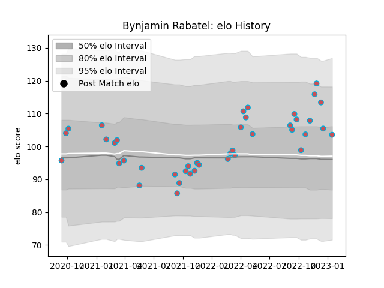

---  
layout: page  
title: Bynjamin Rabatel  
date: 2022-11-22 11:38:38.656422  
categories: player  
---
# Bynjamin Rabatel

## Positions: FL, L

## Current elo: 94.0

## Current Percentile: 23.0

# Elo History

# Match History

| Team             |   Appearances |   Win Rate |
|:-----------------|--------------:|-----------:|
| Bourgoin-Jallieu |            17 |   0.441176 |

| Opponent                   |   Matches |   Win Rate |
|:---------------------------|----------:|-----------:|
| Chambery                   |         2 |       0.5  |
| Nice                       |         2 |       0.5  |
| Tarbes                     |         2 |       0.5  |
| Valence Romans Drome Rugby |         2 |       0.25 |
| Albi                       |         1 |       0    |
| Aubenas                    |         1 |       0    |
| Carqueiranne-Hyères        |         1 |       1    |
| Dax                        |         1 |       1    |
| Dijon                      |         1 |       1    |
| Narbonne                   |         1 |       1    |
| Soyaux-Angouleme           |         1 |       0    |
| Suresnes                   |         1 |       0    |
| US Bressane                |         1 |       0    |