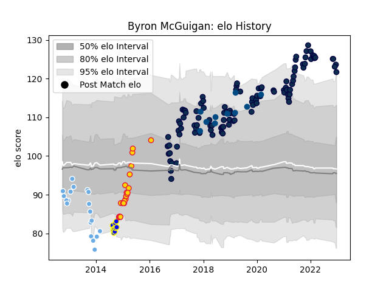

---  
layout: page  
title: Byron McGuigan  
date: 2023-01-06 00:17:55.867129  
categories: player  
---
# Byron McGuigan

## Positions: W, FB

## Country: Scotland

## Current elo: 128.0

## Current Percentile: 93.0

# Elo History

# Match History

| Team             |   Appearances |   Win Rate |
|:-----------------|--------------:|-----------:|
| Sale Sharks      |           110 |   0.55     |
| Exeter Chiefs    |            21 |   0.714286 |
| Glasgow Warriors |            20 |   0.55     |
| Bay of Plenty    |            10 |   0.2      |
| Scotland         |            10 |   0.45     |

| Opponent                 |   Matches |   Win Rate |
|:-------------------------|----------:|-----------:|
| Exeter Chiefs            |        14 |   0.285714 |
| Harlequins               |        12 |   0.666667 |
| Gloucester Rugby         |        11 |   0.545455 |
| Saracens                 |        11 |   0.363636 |
| Wasps                    |        10 |   0.7      |
| Newcastle Falcons        |        10 |   0.5      |
| Bath Rugby               |         9 |   0.666667 |
| Northampton Saints       |         9 |   0.666667 |
| Leicester Tigers         |         9 |   0.555556 |
| Worcester Warriors       |         8 |   0.9375   |
| Bristol Rugby            |         8 |   0.625    |
| London Irish             |         6 |   0.666667 |
| Cardiff Blues            |         5 |   0.8      |
| Connacht                 |         4 |   1        |
| Zebre                    |         3 |   1        |
| Dragons                  |         3 |   0.333333 |
| Leinster                 |         2 |   0.5      |
| Bordeaux Begles          |         2 |   0        |
| Wales                    |         2 |   0        |
| Munster                  |         2 |   0        |
| Toulon                   |         2 |   0        |
| Ulster                   |         2 |   0.5      |
| United States of America |         1 |   0        |
| Stade Toulousain         |         1 |   0        |
| Otago                    |         1 |   1        |
| Southland                |         1 |   0        |
| Scarlets                 |         1 |   0        |
| Taranaki                 |         1 |   0        |
| Waikato                  |         1 |   0        |
| Tasman                   |         1 |   0        |
| Sale Sharks              |         1 |   1        |
| Perpignan                |         1 |   1        |
| Argentina                |         1 |   1        |
| Northland                |         1 |   0        |
| North Harbour            |         1 |   1        |
| New Zealand              |         1 |   0        |
| Manawatu                 |         1 |   0        |
| Auckland                 |         1 |   0        |
| La Rochelle              |         1 |   1        |
| Italy                    |         1 |   1        |
| Hawke's Bay              |         1 |   0        |
| Glasgow Warriors         |         1 |   0        |
| France                   |         1 |   0        |
| England                  |         1 |   0.5      |
| Castres Olympique        |         1 |   0        |
| Canada                   |         1 |   1        |
| Bayonne                  |         1 |   1        |
| Australia                |         1 |   1        |
| London Welsh             |         1 |   1        |