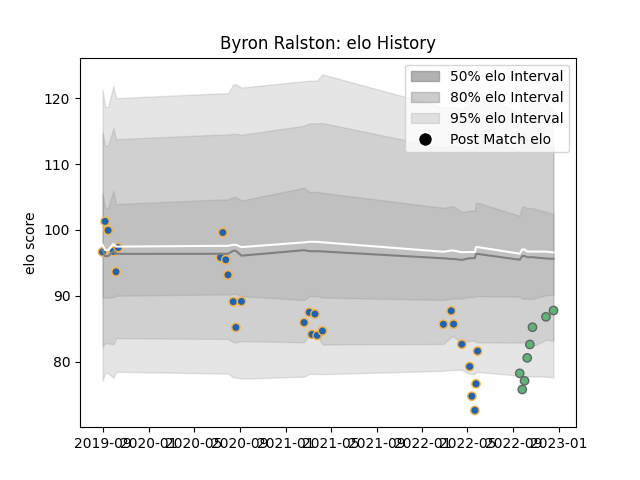

---  
layout: page  
title: Byron Ralston  
date: 2023-01-06 00:23:38.490639  
categories: player  
---
# Byron Ralston

## Positions: W, C

## Current elo: 95.0

## Current Percentile: 17.0

# Elo History

# Match History

| Team          |   Appearances |   Win Rate |
|:--------------|--------------:|-----------:|
| Western Force |            28 |   0.392857 |
| Connacht      |             9 |   0.333333 |

| Opponent                 |   Matches |   Win Rate |
|:-------------------------|----------:|-----------:|
| Melbourne Rebels         |         5 |       0.4  |
| Brumbies                 |         4 |       0    |
| New South Wales Waratahs |         4 |       0.25 |
| Queensland Reds          |         3 |       0    |
| Munster                  |         2 |       0.5  |
| Fijian Drua              |         2 |       1    |
| Leinster                 |         2 |       0    |
| Brisbane City            |         1 |       1    |
| Sydney Rays              |         1 |       1    |
| Stormers                 |         1 |       0    |
| Scarlets                 |         1 |       1    |
| Queensland Country       |         1 |       1    |
| NSW Country Eagles       |         1 |       0    |
| Melbourne Rising         |         1 |       1    |
| Moana Pasifika           |         1 |       1    |
| Brive                    |         1 |       1    |
| Hurricanes               |         1 |       1    |
| Highlanders              |         1 |       0    |
| Crusaders                |         1 |       0    |
| Chiefs                   |         1 |       0    |
| Bulls                    |         1 |       0    |
| Ulster                   |         1 |       0    |