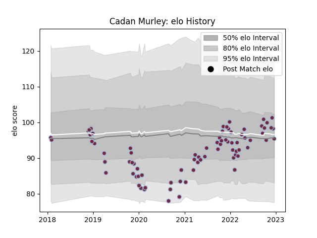

---  
layout: page  
title: Cadan Murley  
date: 2023-03-16 19:51:14.533655  
categories: player  
---
# Cadan Murley

## Positions: W

## Current elo: 94.0

## Current Percentile: 65.0

# Elo History

# Match History

| Team       |   Appearances |   Win Rate |
|:-----------|--------------:|-----------:|
| Harlequins |            90 |   0.533333 |

| Opponent            |   Matches |   Win Rate |
|:--------------------|----------:|-----------:|
| Exeter Chiefs       |         8 |   0.5      |
| Northampton Saints  |         8 |   0.375    |
| Worcester Warriors  |         7 |   0.571429 |
| London Irish        |         6 |   0.583333 |
| Bristol Rugby       |         6 |   0.5      |
| Sale Sharks         |         6 |   0.166667 |
| Gloucester Rugby    |         6 |   0.833333 |
| Wasps               |         5 |   1        |
| Saracens            |         5 |   0.2      |
| Bath Rugby          |         5 |   0.6      |
| Leicester Tigers    |         5 |   0.3      |
| Newcastle Falcons   |         4 |   1        |
| Racing 92           |         3 |   0.333333 |
| Benetton Treviso    |         2 |   0.5      |
| Clermont Auvergne   |         2 |   0        |
| Castres Olympique   |         2 |   1        |
| Sharks              |         2 |   0.5      |
| Cardiff Blues       |         2 |   1        |
| Montpellier Herault |         2 |   0.5      |
| Munster             |         1 |   0        |
| Grenoble            |         1 |   1        |
| Scarlets            |         1 |   1        |
| Ulster              |         1 |   0        |