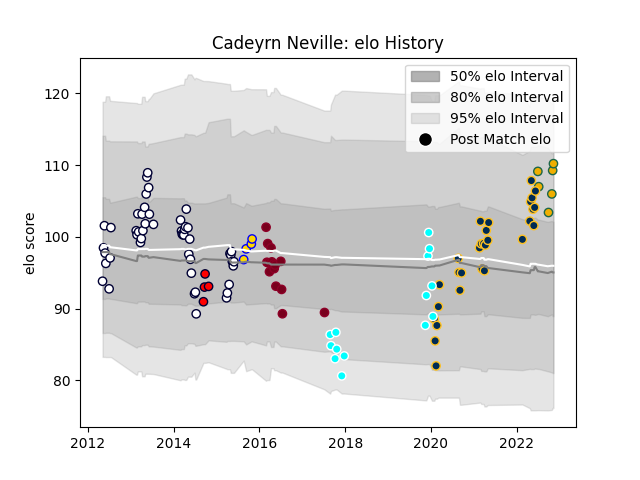

---  
layout: page  
title: Cadeyrn Neville  
date: 2022-11-15 23:41:07.138014  
categories: player  
---
# Cadeyrn Neville

## Positions: L

## Country: Australia

## Current elo: 110.0

## Current Percentile: 86.0

# Elo History

# Match History

| Team                             |   Appearances |   Win Rate |
|:---------------------------------|--------------:|-----------:|
| Melbourne Rebels                 |            49 |   0.306122 |
| Brumbies                         |            29 |   0.689655 |
| Queensland Reds                  |            16 |   0.28125  |
| Toyota Industries Shuttles Aichi |            14 |   0.5      |
| Australia                        |             6 |   0.333333 |
| Brisbane City                    |             4 |   1        |
| Melbourne Rising                 |             4 |   0.75     |

| Opponent                 |   Matches |   Win Rate |
|:-------------------------|----------:|-----------:|
| Queensland Reds          |        13 |   0.307692 |
| Western Force            |        11 |   0.818182 |
| New South Wales Waratahs |        11 |   0.454545 |
| Brumbies                 |         8 |   0.375    |
| Chiefs                   |         6 |   0.5      |
| Hurricanes               |         6 |   0.333333 |
| Blues                    |         5 |   0.3      |
| Highlanders              |         5 |   0.6      |
| Melbourne Rebels         |         5 |   0.6      |
| Crusaders                |         5 |   0.2      |
| Stormers                 |         4 |   0.25     |
| Perth Spirit             |         3 |   0.666667 |
| Bulls                    |         3 |   0        |
| Cheetahs                 |         3 |   0.666667 |
| Sharks                   |         3 |   0        |
| Coca-Cola Red Sparks     |         2 |   0.5      |
| Canberra Vikings         |         2 |   1        |
| Lions                    |         2 |   0        |
| Sunwolves                |         2 |   1        |
| England                  |         2 |   0.5      |
| Southern Kings           |         1 |   0        |
| Sydney Stars             |         1 |   1        |
| Shizuoka Blue Revs       |         1 |   0        |
| Shimizu Blue Sharks      |         1 |   1        |
| Toyota Verblitz          |         1 |   0        |
| Scotland                 |         1 |   1        |
| Saitama Wild Knights     |         1 |   0        |
| France                   |         1 |   0        |
| New Zealand              |         1 |   0        |
| North Harbour Rays       |         1 |   1        |
| Green Rockets Tokatsu    |         1 |   0        |
| NSW Country Eagles       |         1 |   1        |
| Munakata Sanix Blues     |         1 |   1        |
| Moana Pasifika           |         1 |   0        |
| Mazda Blue Zoomers       |         1 |   1        |
| Kyuden Voltex            |         1 |   1        |
| Kurita Water Gush        |         1 |   1        |
| Kamaishi Seawaves        |         1 |   1        |
| Italy                    |         1 |   0        |
| Hanazono Kintetsu Liners |         1 |   0        |
| Yokohama Canon Eagles    |         1 |   0        |