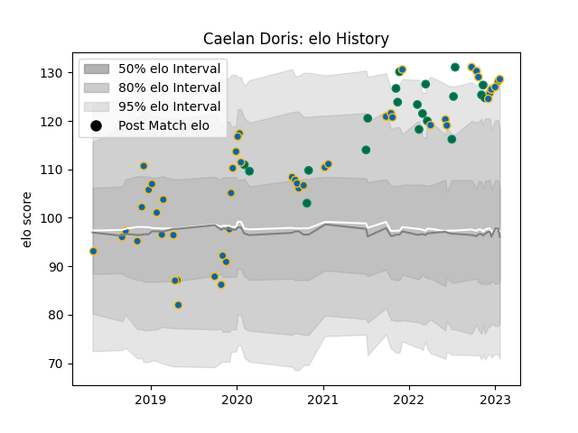

---  
layout: page  
title: Caelan Doris  
date: 2023-02-02 18:54:54.695833  
categories: player  
---
# Caelan Doris

## Positions: N8, FL

## Country: Ireland

## Current elo: 129.0

## Current Percentile: 95.0

# Elo History

# Match History

| Team     |   Appearances |   Win Rate |
|:---------|--------------:|-----------:|
| Leinster |            49 |   0.887755 |
| Ireland  |            20 |   0.8      |

| Opponent                 |   Matches |   Win Rate |
|:-------------------------|----------:|-----------:|
| Munster                  |         6 |   1        |
| Benetton Treviso         |         6 |   0.916667 |
| Connacht                 |         6 |   0.833333 |
| Ulster                   |         5 |   0.8      |
| Glasgow Warriors         |         4 |   0.75     |
| New Zealand              |         4 |   0.75     |
| Dragons                  |         3 |   1        |
| Japan                    |         2 |   1        |
| Southern Kings           |         2 |   1        |
| Scotland                 |         2 |   1        |
| Scarlets                 |         2 |   1        |
| Racing 92                |         2 |   1        |
| Northampton Saints       |         2 |   1        |
| Zebre                    |         2 |   1        |
| Italy                    |         2 |   1        |
| Gloucester Rugby         |         2 |   1        |
| France                   |         2 |   0        |
| England                  |         2 |   0.5      |
| Bulls                    |         2 |   0.5      |
| Lyon                     |         1 |   1        |
| Australia                |         1 |   1        |
| Ospreys                  |         1 |   1        |
| Saracens                 |         1 |   0        |
| Fiji                     |         1 |   1        |
| South Africa             |         1 |   1        |
| Cardiff Blues            |         1 |   1        |
| Stade Toulousain         |         1 |   1        |
| United States of America |         1 |   1        |
| Wales                    |         1 |   1        |
| Argentina                |         1 |   1        |