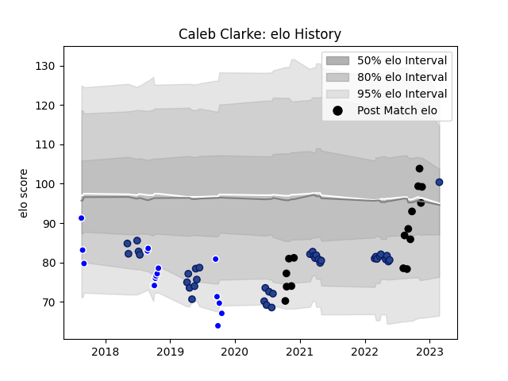

---  
layout: page  
title: Caleb Clarke  
date: 2022-11-16 11:33:40.370197  
categories: player  
---
# Caleb Clarke

## Positions: W

## Country: New Zealand

## Current elo: 101.0

## Current Percentile: 78.0

# Elo History

# Match History

| Team        |   Appearances |   Win Rate |
|:------------|--------------:|-----------:|
| Blues       |            36 |   0.597222 |
| Auckland    |            16 |   0.625    |
| New Zealand |            15 |   0.766667 |

| Opponent                 |   Matches |   Win Rate |
|:-------------------------|----------:|-----------:|
| Chiefs                   |         7 |   0.714286 |
| Highlanders              |         7 |   0.714286 |
| Hurricanes               |         7 |   0.428571 |
| Australia                |         6 |   0.916667 |
| Crusaders                |         5 |   0        |
| Argentina                |         4 |   0.5      |
| Wellington               |         3 |   0.666667 |
| Tasman                   |         2 |   0        |
| Southland                |         2 |   1        |
| South Africa             |         2 |   0.5      |
| Queensland Reds          |         2 |   1        |
| Northland                |         2 |   1        |
| North Harbour            |         2 |   0.5      |
| New South Wales Waratahs |         2 |   1        |
| Counties Manukau         |         2 |   0.5      |
| Brumbies                 |         2 |   0.5      |
| Moana Pasifika           |         1 |   1        |
| Melbourne Rebels         |         1 |   1        |
| Otago                    |         1 |   0        |
| Japan                    |         1 |   1        |
| Scotland                 |         1 |   1        |
| Canterbury               |         1 |   1        |
| Bulls                    |         1 |   0.5      |
| Waikato                  |         1 |   1        |
| Wales                    |         1 |   1        |
| Western Force            |         1 |   1        |