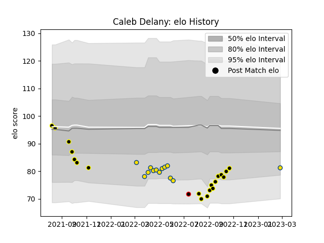

---  
layout: page  
title: Caleb Delany  
date: 2023-03-17 17:11:12.405540  
categories: player  
---
# Caleb Delany

## Positions: FL, L

## Country: New Zealand Maori

## Current elo: 81.0

## Current Percentile: 12.0

# Elo History

# Match History

| Team              |   Appearances |   Win Rate |
|:------------------|--------------:|-----------:|
| Wellington        |            19 |   0.684211 |
| Hurricanes        |            15 |   0.533333 |
| New Zealand Maori |             1 |   0        |

| Opponent                 |   Matches |   Win Rate |
|:-------------------------|----------:|-----------:|
| Canterbury               |         3 |   0.666667 |
| Hawke's Bay              |         3 |   0.666667 |
| Waikato                  |         2 |   0.5      |
| Brumbies                 |         2 |   0        |
| Tasman                   |         2 |   0.5      |
| Taranaki                 |         2 |   0.5      |
| Queensland Reds          |         2 |   1        |
| Highlanders              |         2 |   1        |
| Bay of Plenty            |         2 |   0.5      |
| Melbourne Rebels         |         2 |   1        |
| Auckland                 |         1 |   1        |
| Northland                |         1 |   1        |
| Southland                |         1 |   1        |
| Otago                    |         1 |   1        |
| Ireland                  |         1 |   0        |
| New South Wales Waratahs |         1 |   1        |
| Moana Pasifika           |         1 |   0        |
| Fijian Drua              |         1 |   1        |
| Crusaders                |         1 |   0        |
| Counties Manukau         |         1 |   1        |
| Chiefs                   |         1 |   0        |
| Blues                    |         1 |   0        |
| Western Force            |         1 |   0        |