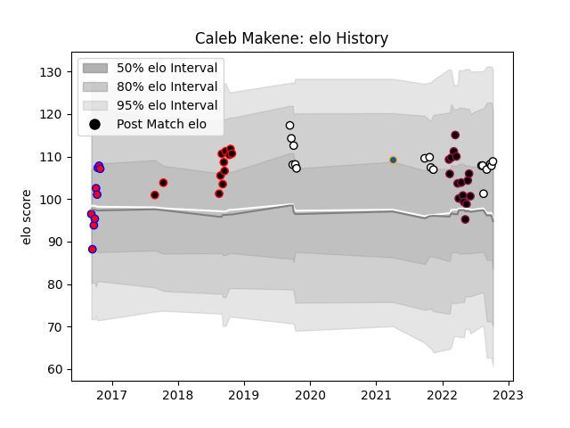

---  
layout: page  
title: Caleb Makene  
date: 2023-03-21 18:02:58.322393  
categories: player  
---
# Caleb Makene

Last updated: 2023-03-21
## Positions: FH, W

## Current elo: 109.0

## Current Percentile: 73.0

# Elo History

# Match History

| Team          |   Appearances |   Win Rate |
|:--------------|--------------:|-----------:|
| Hawke's Bay   |            17 |   0.558824 |
| Utah Warriors |            16 |   0.3125   |
| Canterbury    |            12 |   0.75     |
| Tasman        |             9 |   0.722222 |
| Highlanders   |             1 |   1        |

| Opponent               |   Matches |   Win Rate |
|:-----------------------|----------:|-----------:|
| Otago                  |         5 |   0.6      |
| Tasman                 |         5 |   0.4      |
| Auckland               |         4 |   0.5      |
| Counties Manukau       |         4 |   1        |
| Waikato                |         3 |   0.833333 |
| Wellington             |         3 |   0.666667 |
| Bay of Plenty          |         3 |   0.333333 |
| Dallas Jackals         |         2 |   1        |
| San Diego Legion       |         2 |   0        |
| Canterbury             |         2 |   0        |
| Taranaki               |         2 |   1        |
| Seattle Seawolves      |         2 |   0        |
| North Harbour          |         2 |   0.75     |
| Austin Gilgronis       |         2 |   0.5      |
| Manawatu               |         2 |   1        |
| L. A. Giltinis         |         2 |   0.5      |
| Houston SaberCats      |         2 |   0        |
| Northland              |         1 |   1        |
| Old Glory DC           |         1 |   0        |
| Hawke's Bay            |         1 |   1        |
| Rugby ATL              |         1 |   1        |
| New England Free Jacks |         1 |   0        |
| Southland              |         1 |   1        |
| Toronto Arrows         |         1 |   0        |
| Crusaders              |         1 |   1        |