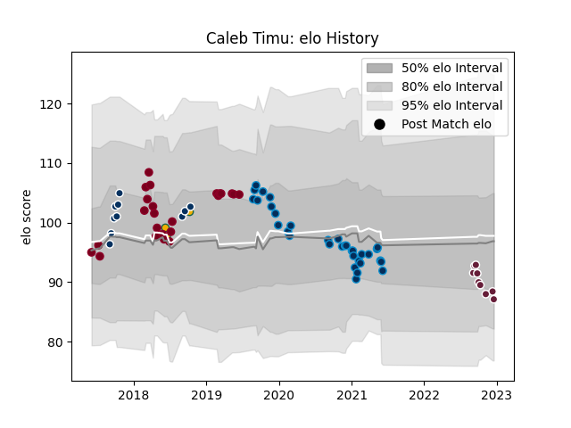

---  
layout: page  
title: Caleb Timu  
date: 2022-12-18 16:39:28.799306  
categories: player  
---
# Caleb Timu

## Positions: N8, FL

## Country: Australia

## Current elo: 87.0

## Current Percentile: 22.0

# Elo History

# Match History

| Team                |   Appearances |   Win Rate |
|:--------------------|--------------:|-----------:|
| Montpellier Herault |            33 |   0.378788 |
| Queensland Reds     |            24 |   0.333333 |
| Queensland Country  |            10 |   0.9      |
| Bordeaux Begles     |             9 |   0.222222 |
| Australia           |             3 |   0.666667 |

| Opponent                 |   Matches |   Win Rate |
|:-------------------------|----------:|-----------:|
| Bayonne                  |         5 |   0.4      |
| Stade Toulousain         |         5 |   0.2      |
| Pau                      |         5 |   0.2      |
| Brumbies                 |         4 |   0.5      |
| New South Wales Waratahs |         4 |   0        |
| Castres Olympique        |         4 |   0.25     |
| Stade Francais Paris     |         3 |   0.833333 |
| Melbourne Rebels         |         3 |   0.333333 |
| Lyon                     |         3 |   0        |
| Highlanders              |         3 |   0        |
| Agen                     |         2 |   0.5      |
| Gloucester Rugby         |         2 |   0.5      |
| Sunwolves                |         2 |   1        |
| Racing 92                |         2 |   0        |
| NSW Country Eagles       |         2 |   1        |
| La Rochelle              |         2 |   1        |
| Ireland                  |         2 |   0.5      |
| Canberra Vikings         |         2 |   0.5      |
| Blues                    |         2 |   0        |
| Bordeaux Begles          |         2 |   0        |
| Brive                    |         2 |   0.5      |
| Fijian Drua              |         2 |   1        |
| Greater Sydney Rams      |         1 |   1        |
| Sydney Rays              |         1 |   1        |
| Stormers                 |         1 |   0        |
| Brisbane City            |         1 |   1        |
| Sharks                   |         1 |   0        |
| Bulls                    |         1 |   1        |
| Chiefs                   |         1 |   0        |
| Montpellier Herault      |         1 |   0        |
| Melbourne Rising         |         1 |   1        |
| Clermont Auvergne        |         1 |   1        |
| Connacht                 |         1 |   0        |
| Lions                    |         1 |   1        |
| Crusaders                |         1 |   0        |
| Jaguares                 |         1 |   1        |
| Argentina                |         1 |   1        |
| Toulon                   |         1 |   1        |