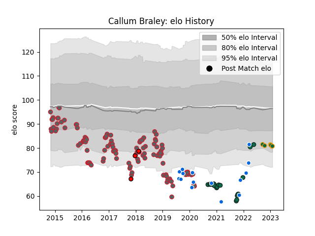

---  
layout: page  
title: Callum Braley  
date: 2023-02-02 19:02:53.694855  
categories: player  
---
# Callum Braley

## Positions: SH

## Country: Italy

## Current elo: 81.0

## Current Percentile: 12.0

# Elo History

# Match History

| Team               |   Appearances |   Win Rate |
|:-------------------|--------------:|-----------:|
| Gloucester Rugby   |           115 |   0.517391 |
| Benetton Treviso   |            20 |   0.25     |
| Italy              |            15 |   0.266667 |
| Northampton Saints |             6 |   0.666667 |
| Hartpury College   |             3 |   0.666667 |

| Opponent            |   Matches |   Win Rate |
|:--------------------|----------:|-----------:|
| Saracens            |        10 |   0.4      |
| Newcastle Falcons   |        10 |   0.6      |
| Exeter Chiefs       |         9 |   0.333333 |
| Harlequins          |         9 |   0.555556 |
| Wasps               |         8 |   0.5625   |
| Leicester Tigers    |         8 |   0.25     |
| Sale Sharks         |         8 |   0.375    |
| Zebre               |         8 |   0.75     |
| Bath Rugby          |         7 |   0.428571 |
| Worcester Warriors  |         6 |   0.5      |
| London Irish        |         6 |   0.833333 |
| Connacht            |         5 |   0.4      |
| La Rochelle         |         4 |   0.5      |
| Northampton Saints  |         4 |   0.5      |
| Munster             |         4 |   0        |
| Cardiff Blues       |         4 |   0.5      |
| Ospreys             |         4 |   0.5      |
| Bristol Rugby       |         4 |   0.5      |
| Ireland             |         3 |   0        |
| Dragons             |         3 |   0.333333 |
| Pau                 |         2 |   0        |
| Wales               |         2 |   0.5      |
| Ulster              |         2 |   0        |
| Scarlets            |         2 |   0        |
| Scotland            |         2 |   0        |
| Agen                |         2 |   1        |
| London Welsh        |         2 |   1        |
| Bayonne             |         2 |   1        |
| France              |         2 |   0        |
| South Africa        |         1 |   0        |
| Benetton Treviso    |         1 |   1        |
| Brive               |         1 |   1        |
| Uruguay             |         1 |   1        |
| Canada              |         1 |   1        |
| Stormers            |         1 |   1        |
| Stade Toulousain    |         1 |   0        |
| New Zealand         |         1 |   0        |
| Montpellier Herault |         1 |   0        |
| Edinburgh           |         1 |   1        |
| England             |         1 |   0        |
| Russia              |         1 |   1        |
| Jersey              |         1 |   0        |
| Leinster            |         1 |   0        |
| Nottingham          |         1 |   1        |
| London Scottish     |         1 |   1        |
| Castres Olympique   |         1 |   1        |