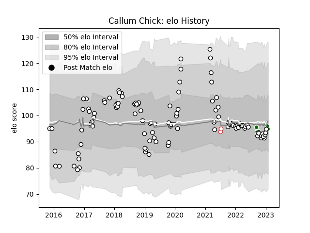

---  
layout: page  
title: Callum Chick  
date: 2022-11-16 11:29:06.895489  
categories: player  
---
# Callum Chick

## Positions: N8, FL

## Country: England

## Current elo: 100.0

## Current Percentile: 55.0

# Elo History

# Match History

| Team                |   Appearances |   Win Rate |
|:--------------------|--------------:|-----------:|
| Newcastle Falcons   |            98 |   0.443878 |
| Ealing Trailfinders |             6 |   1        |
| England             |             2 |   1        |

| Opponent                 |   Matches |   Win Rate |
|:-------------------------|----------:|-----------:|
| Worcester Warriors       |         9 |   0.611111 |
| Saracens                 |         8 |   0        |
| Gloucester Rugby         |         8 |   0.5      |
| Harlequins               |         7 |   0.428571 |
| Bristol Rugby            |         7 |   0.428571 |
| Wasps                    |         7 |   0.428571 |
| Northampton Saints       |         6 |   0.333333 |
| Leicester Tigers         |         5 |   0        |
| Sale Sharks              |         5 |   0.6      |
| Exeter Chiefs            |         5 |   0.2      |
| Bath Rugby               |         4 |   0.25     |
| Bedford                  |         3 |   1        |
| Brive                    |         3 |   0.666667 |
| London Irish             |         3 |   0.333333 |
| Hartpury College         |         3 |   1        |
| Ampthill                 |         2 |   1        |
| RC Enisei                |         2 |   0.5      |
| Montpellier Herault      |         2 |   0.5      |
| Toulon                   |         2 |   0.5      |
| United States of America |         1 |   1        |
| Ospreys                  |         1 |   0        |
| Richmond                 |         1 |   1        |
| Jersey                   |         1 |   1        |
| Lyon                     |         1 |   1        |
| London Scottish          |         1 |   1        |
| Grenoble                 |         1 |   1        |
| Edinburgh                |         1 |   0        |
| Dragons                  |         1 |   1        |
| Doncaster                |         1 |   1        |
| Coventry                 |         1 |   1        |
| Cornish Pirates          |         1 |   1        |
| Connacht                 |         1 |   0        |
| Canada                   |         1 |   1        |
| Yorkshire Carnegie       |         1 |   1        |