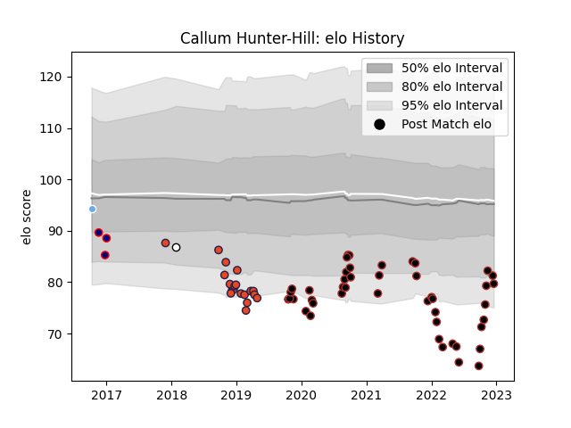

---  
layout: page  
title: Callum Hunter-Hill  
date: 2022-11-15 23:40:40.969041  
categories: player  
---
# Callum Hunter-Hill

## Positions: L

## Current elo: 80.0

## Current Percentile: 6.0

# Elo History

# Match History

| Team              |   Appearances |   Win Rate |
|:------------------|--------------:|-----------:|
| Saracens          |            43 |   0.639535 |
| Edinburgh         |            19 |   0.473684 |
| London Scottish   |             3 |   0.333333 |
| Glasgow Warriors  |             1 |   1        |
| Newcastle Falcons |             1 |   0        |

| Opponent           |   Matches |   Win Rate |
|:-------------------|----------:|-----------:|
| Leicester Tigers   |         5 |   0.8      |
| Northampton Saints |         5 |   0.8      |
| Newcastle Falcons  |         4 |   1        |
| Gloucester Rugby   |         4 |   0.5      |
| London Irish       |         3 |   1        |
| Bristol Rugby      |         3 |   0.666667 |
| Wasps              |         3 |   0        |
| Sale Sharks        |         3 |   0.666667 |
| Glasgow Warriors   |         3 |   0.666667 |
| Harlequins         |         3 |   0.666667 |
| Leinster           |         3 |   0.666667 |
| Worcester Warriors |         2 |   0.5      |
| Southern Kings     |         2 |   0.5      |
| Scarlets           |         2 |   1        |
| Richmond           |         2 |   0.5      |
| Racing 92          |         2 |   0        |
| Bath Rugby         |         2 |   0.25     |
| Exeter Chiefs      |         2 |   1        |
| Dragons            |         2 |   0.5      |
| Zebre              |         2 |   0.5      |
| Munster            |         1 |   0        |
| London Welsh       |         1 |   0        |
| Benetton Treviso   |         1 |   0        |
| Jersey             |         1 |   1        |
| Rotherham Titans   |         1 |   1        |
| Edinburgh          |         1 |   0        |
| Cornish Pirates    |         1 |   0        |
| Ulster             |         1 |   0        |
| Cheetahs           |         1 |   0        |
| Cardiff Blues      |         1 |   0        |