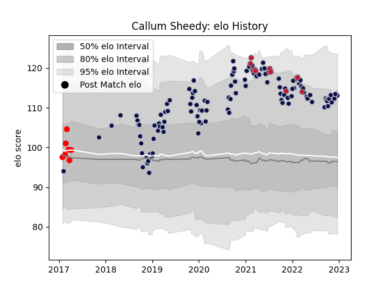

---  
layout: page  
title: Callum Sheedy  
date: 2022-12-09 13:04:40.984060  
categories: player  
---
# Callum Sheedy

## Positions: FH

## Country: Wales

## Current elo: 113.0

## Current Percentile: 88.0

# Elo History

# Match History

| Team          |   Appearances |   Win Rate |
|:--------------|--------------:|-----------:|
| Bristol Rugby |           109 |   0.56422  |
| Wales         |            12 |   0.625    |
| Jersey        |             7 |   0.857143 |

| Opponent             |   Matches |   Win Rate |
|:---------------------|----------:|-----------:|
| Exeter Chiefs        |         9 |   0.333333 |
| Bath Rugby           |         9 |   0.777778 |
| Harlequins           |         9 |   0.444444 |
| Leicester Tigers     |         8 |   0.5625   |
| Gloucester Rugby     |         8 |   0.625    |
| Worcester Warriors   |         7 |   0.571429 |
| Wasps                |         7 |   0.285714 |
| Saracens             |         7 |   0.285714 |
| Sale Sharks          |         7 |   0.357143 |
| Northampton Saints   |         7 |   0.428571 |
| Newcastle Falcons    |         6 |   0.666667 |
| London Irish         |         6 |   0.833333 |
| Zebre                |         4 |   0.625    |
| La Rochelle          |         3 |   0.333333 |
| RC Enisei            |         2 |   1        |
| London Scottish      |         2 |   1        |
| Brive                |         2 |   1        |
| Stade Francais Paris |         2 |   1        |
| Scotland             |         2 |   1        |
| Rotherham Titans     |         2 |   1        |
| Argentina            |         2 |   0.25     |
| Italy                |         2 |   0.5      |
| Ireland              |         2 |   0.5      |
| Dragons              |         1 |   1        |
| Doncaster            |         1 |   0        |
| Nottingham           |         1 |   1        |
| Hartpury College     |         1 |   1        |
| England              |         1 |   1        |
| Cornish Pirates      |         1 |   1        |
| Canada               |         1 |   1        |
| Scarlets             |         1 |   1        |
| Fiji                 |         1 |   1        |
| Toulon               |         1 |   1        |
| Bordeaux Begles      |         1 |   1        |
| Yorkshire Carnegie   |         1 |   1        |
| France               |         1 |   0        |