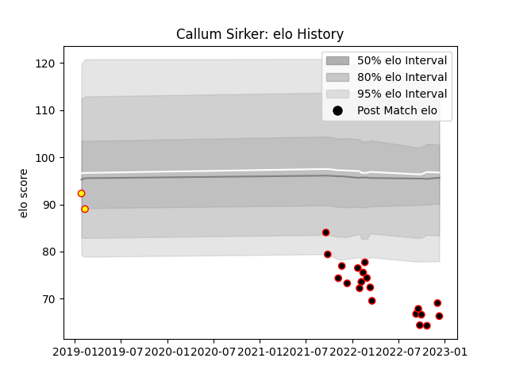

---  
layout: page  
title: Callum Sirker  
date: 2023-01-23 15:34:34.170059  
categories: player  
---
# Callum Sirker

## Positions: W

## Current elo: 50.0

## Current Percentile: 0.0

# Elo History

# Match History

| Team            |   Appearances |   Win Rate |
|:----------------|--------------:|-----------:|
| Cornish Pirates |            22 |   0.568182 |
| Richmond        |             2 |   0        |

| Opponent            |   Matches |   Win Rate |
|:--------------------|----------:|-----------:|
| Bedford             |         4 |   0.5      |
| Richmond            |         3 |   0.833333 |
| Coventry            |         2 |   0.5      |
| Doncaster           |         2 |   0        |
| Ealing Trailfinders |         2 |   0        |
| Hartpury College    |         2 |   0.5      |
| Jersey              |         2 |   0.5      |
| London Scottish     |         2 |   1        |
| Nottingham          |         2 |   1        |
| Ampthill            |         1 |   1        |
| Caldy               |         1 |   0        |
| Cornish Pirates     |         1 |   0        |