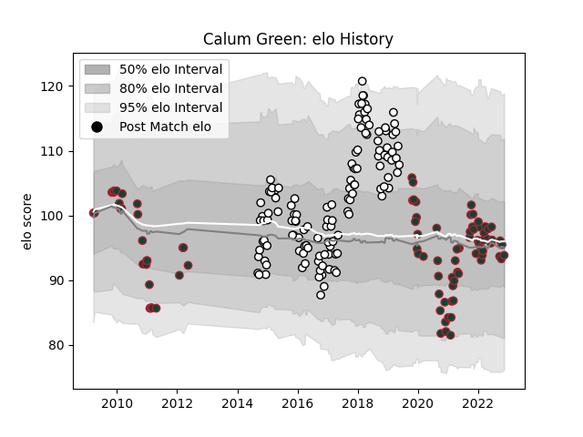

---  
layout: page  
title: Calum Green  
date: 2023-01-06 00:13:19.845555  
categories: player  
---
# Calum Green

## Positions: L

## Current elo: 116.0

## Current Percentile: 85.0

# Elo History

# Match History

| Team              |   Appearances |   Win Rate |
|:------------------|--------------:|-----------:|
| Newcastle Falcons |           124 |   0.407258 |
| Leicester Tigers  |           102 |   0.666667 |

| Opponent             |   Matches |   Win Rate |
|:---------------------|----------:|-----------:|
| Exeter Chiefs        |        21 |   0.285714 |
| Sale Sharks          |        21 |   0.452381 |
| Northampton Saints   |        21 |   0.571429 |
| Bath Rugby           |        18 |   0.555556 |
| Gloucester Rugby     |        18 |   0.611111 |
| Saracens             |        17 |   0.176471 |
| Harlequins           |        17 |   0.441176 |
| London Irish         |        13 |   0.769231 |
| Wasps                |        11 |   0.363636 |
| Worcester Warriors   |         9 |   0.666667 |
| Bristol Rugby        |         8 |   0.625    |
| Leicester Tigers     |         7 |   0.142857 |
| Connacht             |         4 |   0.75     |
| Brive                |         4 |   0.75     |
| Newcastle Falcons    |         4 |   1        |
| RC Enisei            |         4 |   0.75     |
| Yorkshire Carnegie   |         3 |   1        |
| Bordeaux Begles      |         3 |   1        |
| Dragons              |         2 |   1        |
| Leeds                |         2 |   1        |
| London Welsh         |         2 |   1        |
| Montpellier Herault  |         2 |   0.5      |
| Grenoble             |         2 |   0.5      |
| Ospreys              |         2 |   0        |
| Cardiff Blues        |         2 |   0.5      |
| Calvisano            |         2 |   1        |
| Toulon               |         1 |   0        |
| Bucuresti            |         1 |   1        |
| Edinburgh            |         1 |   0        |
| Stade Francais Paris |         1 |   0        |
| Perpignan            |         1 |   0.5      |
| Lyon                 |         1 |   1        |
| Clermont Auvergne    |         1 |   1        |