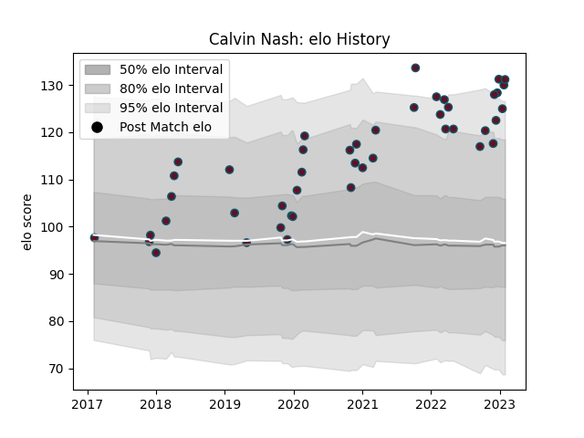

---  
layout: page  
title: Calvin Nash  
date: 2023-02-02 18:43:03.282018  
categories: player  
---
# Calvin Nash

## Positions: W

## Current elo: 131.0

## Current Percentile: 96.0

# Elo History

# Match History

| Team    |   Appearances |   Win Rate |
|:--------|--------------:|-----------:|
| Munster |            45 |   0.744444 |

| Opponent           |   Matches |   Win Rate |
|:-------------------|----------:|-----------:|
| Cardiff Blues      |         5 |   0.8      |
| Zebre              |         4 |   1        |
| Edinburgh          |         4 |   0.75     |
| Ospreys            |         4 |   1        |
| Scarlets           |         4 |   1        |
| Ulster             |         3 |   0.166667 |
| Connacht           |         3 |   1        |
| Leinster           |         3 |   0        |
| Dragons            |         2 |   1        |
| Glasgow Warriors   |         2 |   1        |
| Bulls              |         2 |   0.5      |
| Northampton Saints |         2 |   1        |
| Southern Kings     |         2 |   1        |
| Stade Toulousain   |         2 |   0        |
| Benetton Treviso   |         1 |   1        |
| Stormers           |         1 |   1        |
| Lions              |         1 |   0        |