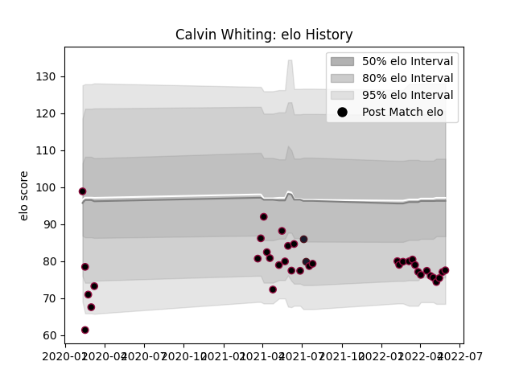

---  
layout: page  
title: Calvin Whiting  
date: 2023-03-02 11:23:31.335675  
categories: player  
---
# Calvin Whiting

## Positions: C

## Country: United States of America

## Current elo: 78.0

## Current Percentile: 10.0

# Elo History

# Match History

| Team                     |   Appearances |   Win Rate |
|:-------------------------|--------------:|-----------:|
| Utah Warriors            |            36 |   0.458333 |
| United States of America |             2 |   0        |

| Opponent               |   Matches |   Win Rate |
|:-----------------------|----------:|-----------:|
| L. A. Giltinis         |         5 |   0.4      |
| Seattle Seawolves      |         5 |   0.4      |
| Houston SaberCats      |         4 |   0.5      |
| New England Free Jacks |         4 |   0.5      |
| San Diego Legion       |         4 |   0.25     |
| Austin Gilgronis       |         3 |   0.666667 |
| Austin Herd            |         2 |   0.75     |
| Old Glory DC           |         2 |   0.5      |
| Rugby ATL              |         2 |   0.5      |
| Toronto Arrows         |         2 |   0.5      |
| Colorado Raptors       |         1 |   0        |
| Dallas Jackals         |         1 |   1        |
| England                |         1 |   0        |
| Ireland                |         1 |   0        |
| NOLA Gold              |         1 |   0        |