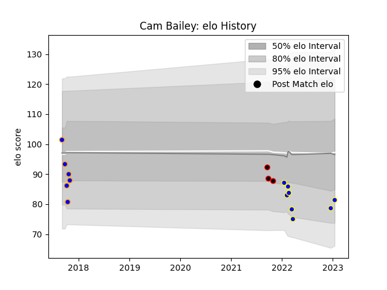

---  
layout: page  
title: Cam Bailey  
date: 2022-12-18 16:20:18.229759  
categories: player  
---
# Cam Bailey

## Positions: FB, W

## Current elo: 75.0

## Current Percentile: 5.0

# Elo History

# Match History

| Team                |   Appearances |   Win Rate |
|:--------------------|--------------:|-----------:|
| Greater Sydney Rams |             6 |   0.333333 |
| Kamaishi Seawaves   |             5 |   0        |
| Canterbury          |             3 |   1        |

| Opponent                 |   Matches |   Win Rate |
|:-------------------------|----------:|-----------:|
| Hino Red Dolphins        |         2 |          0 |
| Brisbane City            |         1 |          1 |
| Canberra Vikings         |         1 |          0 |
| Fijian Drua              |         1 |          0 |
| Hanazono Kintetsu Liners |         1 |          0 |
| Melbourne Rising         |         1 |          0 |
| Mitsubishi Dynaboars     |         1 |          0 |
| NSW Country Eagles       |         1 |          1 |
| Queensland Country       |         1 |          0 |
| Skyactivs Hiroshima      |         1 |          0 |
| Southland                |         1 |          1 |
| Tasman                   |         1 |          1 |
| Waikato                  |         1 |          1 |