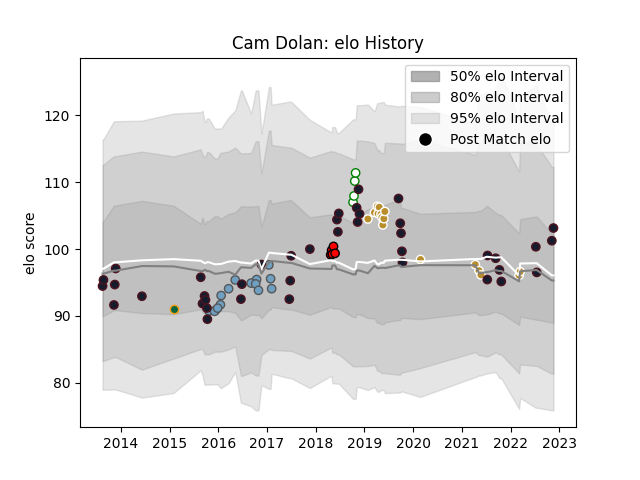

---  
layout: page  
title: Cam Dolan  
date: 2022-11-22 11:34:18.567421  
categories: player  
---
# Cam Dolan

## Positions: N8, L

## Country: United States of America

## Current elo: 103.0

## Current Percentile: 72.0

# Elo History

# Match History

| Team                     |   Appearances |   Win Rate |
|:-------------------------|--------------:|-----------:|
| United States of America |            40 |      0.4   |
| NOLA Gold                |            16 |      0.625 |
| Cardiff Blues            |            15 |      0.6   |
| San Diego Legion         |             5 |      0.4   |
| Nottingham               |             4 |      0.75  |
| Northampton Saints       |             1 |      0     |

| Opponent            |   Matches |   Win Rate |
|:--------------------|----------:|-----------:|
| Canada              |         8 |   0.6875   |
| Houston SaberCats   |         4 |   0.75     |
| Utah Warriors       |         3 |   1        |
| Russia              |         3 |   1        |
| Seattle Seawolves   |         3 |   0.333333 |
| Scotland            |         3 |   0.333333 |
| England             |         2 |   0        |
| San Diego Legion    |         2 |   0        |
| Austin Elite Rugby  |         2 |   0.5      |
| Ireland             |         2 |   0        |
| Georgia             |         2 |   0.5      |
| Samoa               |         2 |   0.5      |
| Edinburgh           |         2 |   1        |
| New Zealand Maori   |         2 |   0        |
| Tonga               |         2 |   0        |
| Chile               |         2 |   0.5      |
| Toronto Arrows      |         2 |   1        |
| Scarlets            |         1 |   0        |
| New Zealand         |         1 |   0        |
| South Africa        |         1 |   0        |
| Sale Sharks         |         1 |   0        |
| Romania             |         1 |   1        |
| Richmond            |         1 |   1        |
| Ulster              |         1 |   0        |
| R.U. New York       |         1 |   0        |
| Portugal            |         1 |   0.5      |
| Uruguay             |         1 |   0        |
| Pau                 |         1 |   1        |
| Ospreys             |         1 |   0        |
| Argentina           |         1 |   0        |
| Kenya               |         1 |   1        |
| Munster             |         1 |   1        |
| Dragons             |         1 |   1        |
| Austin Gilgronis    |         1 |   0        |
| Australia           |         1 |   0        |
| Bristol Rugby       |         1 |   1        |
| Calvisano           |         1 |   1        |
| Colorado Raptors    |         1 |   1        |
| Connacht            |         1 |   1        |
| Cornish Pirates     |         1 |   0        |
| Dallas Jackals      |         1 |   1        |
| Ealing Trailfinders |         1 |   1        |
| Montpellier Herault |         1 |   1        |
| France              |         1 |   0        |
| Germany             |         1 |   1        |
| Glendale Raptors    |         1 |   0        |
| Harlequins          |         1 |   0        |
| Hartpury College    |         1 |   1        |
| Italy               |         1 |   0        |
| Japan               |         1 |   0        |
| Leicester Tigers    |         1 |   0        |
| Worcester Warriors  |         1 |   0        |