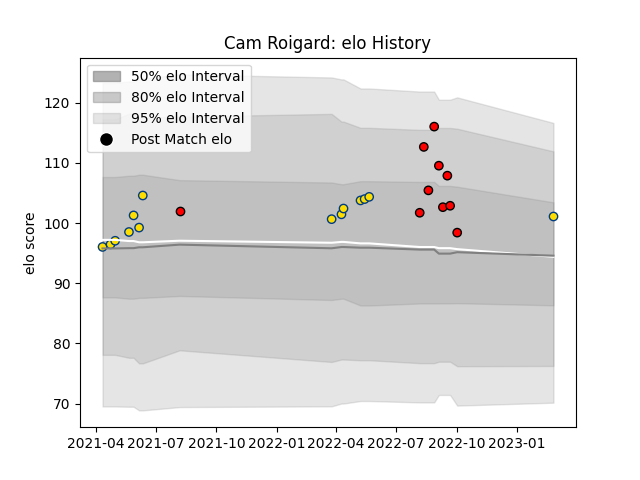

---  
layout: page  
title: Cam Roigard  
date: 2023-03-02 11:24:35.731158  
categories: player  
---
# Cam Roigard

## Positions: SH

## Current elo: 101.0

## Current Percentile: 61.0

# Elo History

# Match History

| Team             |   Appearances |   Win Rate |
|:-----------------|--------------:|-----------:|
| Hurricanes       |            14 |   0.642857 |
| Counties Manukau |            10 |   0.3      |

| Opponent                 |   Matches |   Win Rate |
|:-------------------------|----------:|-----------:|
| Melbourne Rebels         |         2 |        1   |
| Crusaders                |         2 |        0   |
| Queensland Reds          |         2 |        1   |
| Manawatu                 |         2 |        0.5 |
| Moana Pasifika           |         2 |        0.5 |
| New South Wales Waratahs |         1 |        1   |
| Wellington               |         1 |        0   |
| Waikato                  |         1 |        0   |
| Taranaki                 |         1 |        0   |
| Otago                    |         1 |        1   |
| North Harbour            |         1 |        0   |
| Bay of Plenty            |         1 |        1   |
| Brumbies                 |         1 |        0   |
| Highlanders              |         1 |        1   |
| Hawke's Bay              |         1 |        0   |
| Fijian Drua              |         1 |        1   |
| Chiefs                   |         1 |        0   |
| Canterbury               |         1 |        0   |
| Western Force            |         1 |        1   |