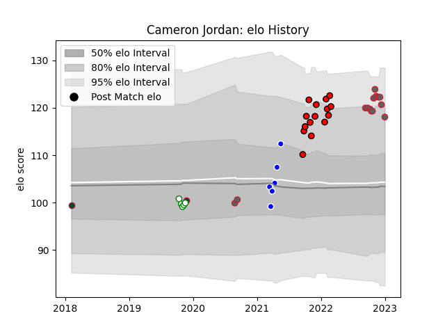

---  
layout: page  
title: Cameron Jordan  
date: 2023-02-02 18:41:36.652561  
categories: player  
---
# Cameron Jordan

## Positions: L

## Current elo: 117.0

## Current Percentile: 90.0

# Elo History

# Match History

| Team             |   Appearances |   Win Rate |
|:-----------------|--------------:|-----------:|
| Gloucester Rugby |            18 |   0.5      |
| Hartpury College |            15 |   0.433333 |
| Coventry         |             6 |   0.666667 |
| Nottingham       |             5 |   0.4      |
| Leicester Tigers |             2 |   0.5      |

| Opponent            |   Matches |   Win Rate |
|:--------------------|----------:|-----------:|
| Ampthill            |         4 |   0.75     |
| Jersey              |         4 |   0.25     |
| Ealing Trailfinders |         3 |   0        |
| Bedford             |         3 |   0.666667 |
| Saracens            |         3 |   0        |
| Exeter Chiefs       |         3 |   0.333333 |
| Nottingham          |         2 |   0.5      |
| London Scottish     |         2 |   0.75     |
| London Irish        |         2 |   1        |
| Hartpury College    |         2 |   0.5      |
| Doncaster           |         2 |   0        |
| Cornish Pirates     |         2 |   0.5      |
| Bordeaux Begles     |         2 |   1        |
| Wasps               |         2 |   0.5      |
| Harlequins          |         1 |   0        |
| Bath Rugby          |         1 |   1        |
| Coventry            |         1 |   1        |
| Leinster            |         1 |   0        |
| Cardiff Blues       |         1 |   1        |
| Newcastle Falcons   |         1 |   0        |
| Northampton Saints  |         1 |   1        |
| Bristol Rugby       |         1 |   1        |
| Richmond            |         1 |   1        |
| Sale Sharks         |         1 |   0        |