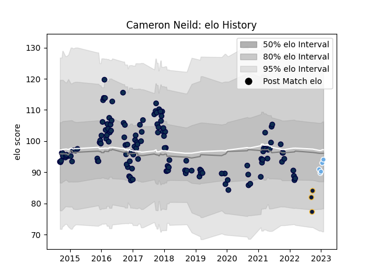

---  
layout: page  
title: Cameron Neild  
date: 2023-01-06 00:15:18.113236  
categories: player  
---
# Cameron Neild

## Positions: FL

## Current elo: 105.0

## Current Percentile: 54.0

# Elo History

# Match History

| Team               |   Appearances |   Win Rate |
|:-------------------|--------------:|-----------:|
| Sale Sharks        |           134 |   0.503731 |
| Glasgow Warriors   |             3 |   1        |
| Worcester Warriors |             3 |   0.333333 |

| Opponent            |   Matches |   Win Rate |
|:--------------------|----------:|-----------:|
| Exeter Chiefs       |        14 |   0.142857 |
| Bath Rugby          |        11 |   0.454545 |
| Saracens            |        11 |   0.136364 |
| Northampton Saints  |        11 |   0.454545 |
| Harlequins          |        11 |   0.636364 |
| Wasps               |        10 |   0.7      |
| Leicester Tigers    |        10 |   0.7      |
| Gloucester Rugby    |         9 |   0.333333 |
| Worcester Warriors  |         9 |   0.722222 |
| Newcastle Falcons   |         7 |   0.642857 |
| London Irish        |         7 |   0.785714 |
| Bristol Rugby       |         5 |   0.6      |
| Scarlets            |         4 |   0.75     |
| Cardiff Blues       |         3 |   0.666667 |
| Edinburgh           |         2 |   1        |
| Lyon                |         2 |   0.5      |
| Stade Toulousain    |         2 |   0.25     |
| Dragons             |         2 |   0.5      |
| Pau                 |         2 |   1        |
| Castres Olympique   |         2 |   1        |
| Toulon              |         1 |   0        |
| Glasgow Warriors    |         1 |   0        |
| La Rochelle         |         1 |   0        |
| Munster             |         1 |   0        |
| Montpellier Herault |         1 |   0        |
| London Welsh        |         1 |   1        |